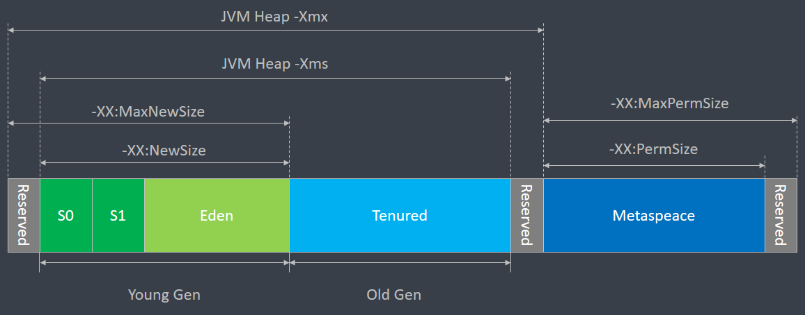
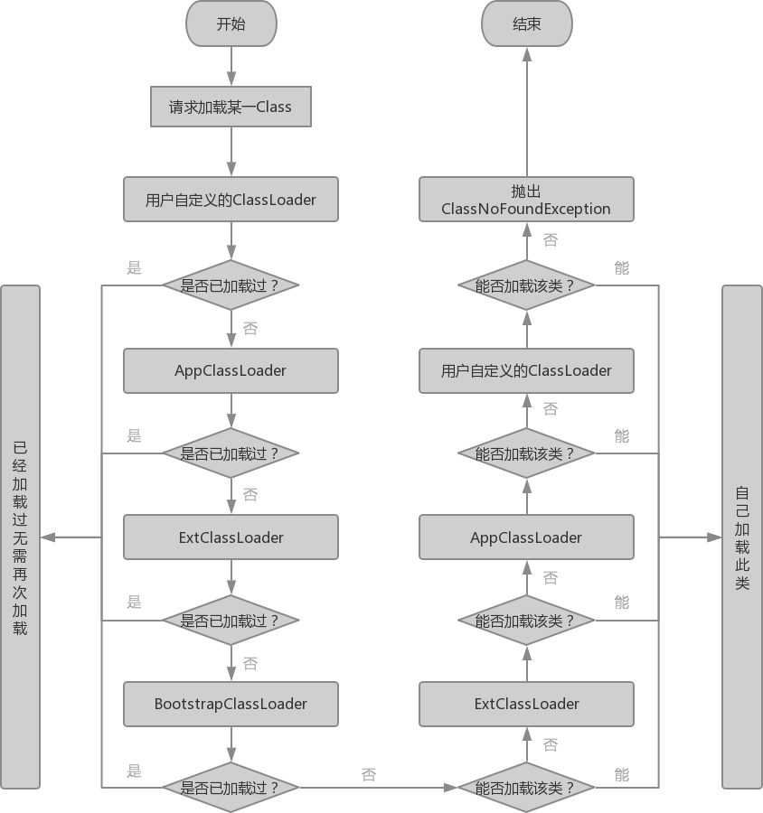

# 1.JVM内存结构


## 1.1 线程共享区

线程共享区为所有线程可见，分为堆区和方法区，在此区域分配内存失败时，JVM将抛出OOM（OutOfMemoryError）异常

### 1.1.1 堆区（-Xms，-Xmx）：

堆区是所有区域中最大的一块，几乎所有对象的实例都存放在堆区。堆区也是GC的主要区域，因此也被称为“GC堆”。堆区的大小可以通过JVM启动参数-Xms和-Xmx来设置堆区的最小值和最大值。

### 1.1.2 方法区：

方法区主要用于存放已经被JVM加载的类的信息、常量、静态变量、即时编译的后代码数据等信息。

## 1.2 线程独占区

线程独占区是每个线程都拥有的部分，分为JVM栈、本地方法栈和程序计数器

### 1.2.2 程序计数器

程序计数器是一块较小的内存空间，其作用是保存当前线程所执行的字节码的行号，分之、循环、跳转、异常处理等都需要通过程序计数器来完成。

### 1.2.2 JVM栈：

JVM栈描述的是Java方法执行的内存模型，每个方法被执行的时候会同时创建一个栈帧用户存储局部变量表、操作栈、动态链接、方法出口等信息。每一个方法被调用到执行完成的过程，就对应了一个栈帧在JVM栈的入栈和出栈过程

### 1.2.3 本地方法栈

本地方法栈的作用和JVM栈相似，只不过为Native方法服务。


## 1.3 堆和栈的区别

堆：线程之间可以共享数据，用于存放对象实例、数组等，由JVM自行回收。

栈：线程之间不可共享，用于存放局部变量和对象的引用，每个方法的调用都对应于方法栈帧的入栈、方法调用结束后都对应方法栈帧的出栈、局部变量和引用的回收。

# 2.垃圾回收（GC）

Java语言的一大优势之一就是不需要开发者控制内存的回收，因此垃圾回收时JVM中自动管理内存最重要的方式。当JVM内存不足的时候便会启用垃圾回收机制，将不再使用的内存进行回收，以便再次进行使用。

## 2.1 垃圾回收基本知识

### 2.1.1 什么时候需要进行垃圾回收

- **新生代空间不足**：从JVM的内存结构中可以了解到，所有的对象初始都是在新生代中被创建的，因此新生代会发生频繁的对象创建和销毁。当**新生代（即Eden区）的空间无法容纳新创建的对象时**将会发生**Minor GC**，由于大多数Java对象存活时间都很短，因此新生代也是GC发生最频繁的区域。
- **老年代空间不足**：一些Java对象再经历过多次GC之后依然存活，那么这些对象将会被放入老年代中，或者一些大对象会直接被放入老年代中。当**老年代空间不足**时则会触发**Full GC**对老年代进行垃圾回收，一般而言Full GC通常都会伴随一次Minor GC。
- **显示调用System.gc()**：当代码中显示地调用System.gc()时，只是会**提示**JVM需要进行垃圾回收，但**是否需要进行垃圾回收则由JVM做出决定**。

### 2.1.2 如何判断哪些对象需要被回收

- 引用计数：每个对象都有一个引用计数属性，每新增一个引用，计数+1，每释放一次引用，计数-1。当一个对象的引用数量为0时，该对象被认为是可回收的。引用计数方法简单，但是无法解决循环引用的问题。

- 可达性分析法：从GC Roots开始向下搜索，搜索所走过的路径被称为引用连。当一个对象到GC Roots没有任何引用链相连时，该对象被认为是不可用的，是不可达的对象，可以被回收。

### 2.1.3 GC Roots有哪些

- Class： 由系统类加载器(system class loader)加载的对象，这些类是不能够被回收的，他们可以以静态字段的方式保存持有其它对象。

- Thread：活着的线程

- Stack Local：方法的local变量

- JNI Local：JNI方法的local变量或参数

- JNI Global：全局JNI引用

### 2.1.4 安全点SafePoint

SafePoint是JVM中一个重要的概念，很多场景都需要使用到SafePoint，尤其是GC的时候。SafePoint顾名思义是安全点的意思，在JVM运行时候会有许多SafePoint，当线程运行到这些位置的时候，线程的一些状态可以被确定，比如

### 2.1.5 JVM停顿StopTheWorld（STW）


## 2.2 垃圾回收算法

### 2.2.1 标记-清除


标记-清除算法分为“标记”和“清除”两个阶段，首先标记处所有需要回收的对象，然后统一回收掉所有被标记的对象。该方法简单但是存在以下两个主要的缺点：

- 效率问题：标记和清除的效率都不高。
- 空间问题：清除过后会产生大量不连续的内存碎片，碎片过多时，当需要给较大的对象分配连续的空间时，容易找不到合适的空间导致触发下一次GC。

### 2.2.2 复制算法


复制算法将内存划分为大小相等的两块，每次只使用其中的一块。当发生GC时，将存活的对象复制到另一块内存中，然后将当前的内存全部清理掉。

- **优点**：复制算法实现简单，并且克服了标记-清除算法容易产生内存碎片的问题，运行高效。
- **缺点**：可用的内存仅为原来的一半，并且需要持续复制长期生存的对象，导致效率降低。

### 2.2.3 标记-整理算法


### 2.2.4 分代收集算法

Hotspot虚拟机的堆内存结构如下：



分代收集算法将堆中的对象划分为新生代和老年代，这样就可以根据各年代的特点采用最适当的垃圾回收算法。

- **新生代**：新生代被划分为一块较大的Eden区和两个较小的Survivor区——From区和To区。所有新生的对象都会被放入Eden区，当Eden区空间不足时会触发Minor GC，此时还存活的对象会被放入From Survivor区。当第二次发生Minor GC时，Eden区和From Survivor区中存活的对象会被放入To Survivor区，然后清理掉Eden区和From区，并将From区和To区进行交换。新生代中的对象每经历一次Minor GC其年龄都会+1，当一个对象经历15次以上的Minor GC后，JVM会将其复制到老年代中。由于新生代中有大量的对象被创建，和大量的对象死亡，因此需要高效的GC算法。大部分商业JVM中使用的都是复制算法。
 - **老年代**：老年代主要存放长期存活的对象、常量对象等，其发生GC的次数较少。当年老区空间不足时，将会触发Major GC，对老年代进行清理。由于老年代发生GC不那么频繁，并且往往都是存放较大的对象，因此需要有较多连续的空间，可以使用标记-整理或标记-清楚算法。

## 2.3 垃圾收集器

垃圾收集算法为JVM提供了垃圾回收的方法和理论基础，但是JVM并没有对垃圾收集器的具体实现做出规定，因此不同的厂商、不同版本的JVM所提供的垃圾收集器存在差别，不同场合下，不同堆区选用的垃圾收集器也各不相同。一般而言，JVM主要有以下7种常见的垃圾收集器：

|              | Serial   | SerialOld | ParNew   | CMS       | ParallelScavenge | Paralell Old | G1     |
| ------------ | -------- | --------- | -------- | --------- | ---------------- | ------------ | ------ |
| 垃圾收集算法 | 复制算法 | 标记-整理 | 复制算法 | 标记-清除 | 复制算法         | 标记-整理    |        |
| 线程         | 单线程   | 单线程    | 多线程   | 多线程    | 多线程           | 多线程       | 多线程 |
| GC区域       | 新生代   | 老年代    | 新生代   | 老年代    | 新生代           | 老年代       | 整堆   |


### 新生代收集器

### 2.3.1 Serial收集器

Serial收集器是最基本、发展历史最悠久的垃圾收集器，其针对的是新生代的垃圾回收，具有以下特点：

- 针对新生代

- 采用复制算法

- 使用单线程收集

- 执行垃圾回收时需要STW直到完成

在默认情况下JVM会以Client的方式运行，此时默认的新生代收集器是Serial收集器

### 2.3.2 ParNew收集器

### 2.3.3 ParallelScavenge收集器

### 老年代收器

### 2.3.4 SerialOld收集器

### 2.3.5 CMS收集器

### 2.3.6 ParallelOld收集器

### 整堆收集器

### 2.3.7 G1收集器


## 2.5 JVM的相关命令

### 2.5.1 jps

jps命令可以用来列出所有正在运行的java进程及相关信息，主要用于获取java进程的进程id

**使用方法**：jps [参数]

参数列表：

| 参数 | 说明                                        |
| ---- | ------------------------------------------- |
| -q   | 只显示进程ID                                |
| -m   | 显示传入main方法的参数                      |
| -l   | 输出完全的报名，应用的主类名，jar的完全路径 |
| -v   | 显示JVM参数                                 |

```bash
root@Claudy-Server:~# jps
8786 Bootstrap
2482 Jps
6277 Apollo

root@Claudy-Server:~# jps -l
8786 org.apache.catalina.startup.Bootstrap
6277 org.apache.activemq.apollo.boot.Apollo
2456 sun.tools.jps.Jps

root@Claudy-Server:~# jps -m
8786 Bootstrap start
2517 Jps -m
6277 Apollo /root/mqtt/apache-apollo-1.7.1/bin/myBroker/lib\;/root/mqtt/apache-apollo-1.7.1/lib org.apache.activemq.apollo.cli.Apollo run

root@Claudy-Server:~# jps -v
8786 Bootstrap -Djava.util.logging.config.file=/root/apache-tomcat-8.0.47/conf/logging.properties -Djava.util.logging.manager=org.apache.juli.ClassLoaderLogManager -XX:+HeapDumpOnOutOfMemoryError -XX:HeapDumpPath=/var/bathFile/error -XX:OnOutOfMemoryError=/root/onOOM.sh -Djdk.tls.ephemeralDHKeySize=2048 -Djava.protocol.handler.pkgs=org.apache.catalina.webresources -Djava.endorsed.dirs=/root/apache-tomcat-8.0.47/endorsed -Dcatalina.base=/root/apache-tomcat-8.0.47 -Dcatalina.home=/root/apache-tomcat-8.0.47 -Djava.io.tmpdir=/root/apache-tomcat-8.0.47/temp
2530 Jps -Denv.class.path=.:/root/jdk1.8.0_151/lib/dt.jar:/root/jdk1.8.0_151/lib/tools.jar:/root/jdk1.8.0_151/jre/lib: -Dapplication.home=/root/jdk1.8.0_151 -Xms8m
6277 Apollo -ea -Xmx1G -Xms1G -Dcom.sun.management.jmxremote -Dapollo.home=/root/mqtt/apache-apollo-1.7.1 -Dapollo.base=/root/mqtt/apache-apollo-1.7.1/bin/myBroker
```

### 2.5.2 jstat

jstat命令可以用来监视JVM中各种运行状态，可以显示JVM中类装载、内存使用情况以及垃圾回收等信息，适合用于JVM性能调优和一些问题的定位。

**使用方法**：jstat [参数] [pid] [时间间隔(ms)] [查询次数]

- pid：即JVM的进程号
- 时间间隔：配合查询次数使用，即每隔指定的时间打印一次信息
- 查询次数：配合时间间隔使用，表示总共需要打印的次数

参数列表：

| 参数            | 说明                 |
| --------------- | -------------------- |
| -class          | 统计类加载信息       |
| -compiler       | 编译统计             |
| -gc             | 查看各区大小和GC次数 |
| -gccapacity     | 堆内存容量信息汇总   |
| -gcnew          | 新生代堆内存使用情况 |
| -gcnewcapacity  | 新生代堆内存容量信息 |
| -gcold          | 老年代堆内存使用情况 |
| -gcoldcapacity  | 老年代堆内存容量信息 |
| -gcmetacapacity | 元空间堆内存容量信息 |
| -gcutil         | 各分代的空间占用比例 |

#### 2.5.2.1 jstat -class

参数-class用于类加载统计

```bash
root@Claudy-Server:~# jstat -class 8786
Loaded  Bytes  Unloaded  Bytes     Time
 15123 27860.7        0     0.0       8.71
```

| 列名     | 含义              |
| -------- | ----------------- |
| Loaded   | 加载的class数量   |
| Bytes    | 所占空间大小      |
| Unloaded | 未加载的class数量 |
| Time     | 加载时间          |

#### 2.5.2.1 jstat -compile

参数-compile可以显示编译器的相关信息

```bash
root@Claudy-Server:~# jstat -compiler 8786
Compiled Failed Invalid   Time   FailedType FailedMethod
   16203      2       0    58.84          1 sun/misc/URLClassPath getLoader
```

| 列名       | 含义                       | 列名         | 含义                             |
| ---------- | -------------------------- | ------------ | -------------------------------- |
| Compiled   | 编译任务执行的次数         | Failed       | 编译失败的次数                   |
| Invalid    | 编译任务执行无效的次数     | Time         | 编译的总时间                     |
| FailedType | 最后一次编译失败任务的类型 | FailedMethod | 最后一次编译失败任务所在的类方法 |

#### 2.5.2.3 jstat -gc

参数-gc用于统计JVM各个区的容量以及各个区的使用情况

```bash
root@Claudy-Server:~# jstat -gc 8786
 S0C    S1C    S0U    S1U      EC       EU        OC         OU       MC     MU    CCSC   CCSU   YGC     YGCT    FGC    FGCT     GCT
512.0  512.0   0.0   257.1  34816.0  33248.9   146432.0   71405.1   87296.0 84021.6 10752.0 10168.9    581    4.215   3      0.726    4.941
```

| 列名 | 含义                    | 列名 | 含义                          |
| ---- | ----------------------- | ---- | ----------------------------- |
| S0C  | Survivor0区容量（Byte） | S0U  | Survivor0区已使用空间（Byte） |
| S1C  | Survivor1区容量（Byte） | S1U  | Survivor1区已使用空间（Byte） |
| EC   | Eden区容量（Byte）      | EU   | Eden区已使用空间（Byte）      |
| OC   | Old区容量（Byte）       | OU   | Old区已使用空间（Byte）       |
| MC   | 元空间容量（Byte）      | MU   | 元空间已使用空间（Byte）      |
| CCSC | 压缩类空间容量（Byte）  | CCSU | 压缩类已使用空间（Byte）      |
| YGC  | 年轻代GC次数            | YGCT | 年轻代GC总时间（s）           |
| FGC  | Full GC次数             | FGCT | Full GC总时间（s）            |
| GCT  | GC总时间（s）           |      |                               |

#### 2.5.2.4 jstat -gccapacity

参数-gccapacity用于查看各分代中的堆内存信息

```bash
root@Claudy-Server:~# jstat -gccapacity 8786
 NGCMN    NGCMX     NGC     S0C   S1C       EC      OGCMN      OGCMX       OGC         OC       MCMN     MCMX      MC     CCSMN    CCSMX     CCSC    YGC    FGC
 43008.0 680960.0  74752.0  512.0  512.0  34816.0    86016.0  1362944.0   146432.0   146432.0      0.0 1126400.0  87296.0      0.0 1048576.0  10752.0    666     3
```

| 列名  | 含义                     | 列名  | 含义                     |
| ----- | ------------------------ | ----- | ------------------------ |
| NGCMN | 新生代初始容量（Byte）   | NGCMX | 新生代最大容量（Byte）   |
| NGC   | 新生代当前区容量（Byte） |       |                          |
| S0C   | Survivor0当前区容量（Byte） | S1C   | Survivor1当前区容量（Byte） |
| EC    | Eden当前区容量（Byte）     |       |                          |
| OGCMN | 老年代初始容量（Byte）   | OGCMX | 老年代最大容量（Byte）   |
| OGC   | 老年代新生成的（Byte）   | OC    | 老年代当前区容量（Byte） |
| MCMN  | 元空间初始容量（Byte）   | MCMX  | 元空间最大容量（Byte）   |
| MC    | 元空间当前区容量（Byte） |       |                          |
| CSSMN | 压缩类初始容量（Byte）     | CCSMX | 压缩类最大容量（Byte）     |
| CCSC  | 压缩类前区容量（Byte） |       |                          |
| YGC   | 年轻代GC次数             | FGC   | Full GC总次数            |

#### 2.5.2.5 jstat -gcnew

参数-gcnew用于查看新生代的堆内存使用情况

```bash
root@Claudy-Server:~# jstat -gcnew 8786
 S0C    S1C    S0U    S1U   TT MTT  DSS      EC       EU     YGC     YGCT
 512.0  512.0    0.0  304.0 15  15  512.0  34816.0  24897.3    691    4.904
```

| 列名 | 含义                             | 列名 | 含义                        |
| ---- | -------------------------------- | ---- | --------------------------- |
| S0C  | Survivor0区当前容量（Byte）         | S1C  | Survivor1区当前容量（Byte）    |
| S0U  | Survivor0区已使用空间（Byte）      | S1U  | Survivor1区已使用空间（Byte） |
| TT   | 持有次数限制，超过会被放入老年代 | MTT  | 最大只有次数限制            |
| DSS  | 期望的幸存区大小（Byte）           |      |                             |
| EC   | Eden区当前容量（Byte）               | EU   | Eden已使用空间（Byte）        |
| YGC  | 新生代GC总次数                   | YGCT | 新生代GC总时间（s）         |

#### 2.5.2.6 jstat -gcnewcapacity

参数-gcnewcapcity用于查看新生代堆内存的容量信息

```bash
root@Claudy-Server:~# jstat -gcnewcapacity 8786
  NGCMN      NGCMX       NGC      S0CMX     S0C     S1CMX     S1C       ECMX        EC      YGC   FGC
  43008.0   680960.0    74752.0 226816.0    512.0 226816.0    512.0   679936.0    34816.0   707     3
```

| 列名  | 含义                        | 列名  | 含义                          |
| ----- | --------------------------- | ----- | ----------------------------- |
| NGCMN | 年轻代初始容量（Byte）      | NGCMX | 年轻代最大容量（Byte）        |
| NGC   | 新生代当前容量（Byte）      |       |                               |
| S0CMX | Survivor0区最大容量（Byte） | S0C   | Survivor0区已使用空间（Byte） |
| S1CMX | Survivor1区最大容量（Byte） | S1C   | Survivor1区已使用空间（Byte） |
| ECMX  | Eden区最大容量（Byte）      | EC    | Eden区当前容量（Byte）        |
| YGC   |                             | FGC   |                               |

#### 2.5.2.7 jstat -gcold

参数-gcold用于查看示老年代的堆内存使用情况

```bash
root@Claudy-Server:~# jstat -gcold 8786
   MC       MU      CCSC     CCSU       OC          OU       YGC    FGC    FGCT     GCT
 87296.0  84131.8  10752.0  10171.0    146432.0     73477.5    716     3    0.726    5.802
```

| 列名 | 含义                       | 列名 | 含义                         |
| ---- | -------------------------- | ---- | ---------------------------- |
| MC   | 元空间当前容量（Byte）     | MU   | 元空间已使用空间（Byte）     |
| CCSC | 压缩类空间当前容量（Byte） | CCSU | 压缩类空间已使用空间（Byte） |
| OC   | 老年代当前容量（Byte）     | OU   | 老年代已使用空间（Byte）     |
| YGC  | 新生代GC总次数             | FGC  | Full GC总次数                |
| FGCT | Full GC总时间（s）         | GCT  | GC总时间（s）                |

#### 2.5.2.7 jstat -gcoldcapacity

参数-gccoldcapacity用于查看老年代的堆内存容量信息

```bash
root@Claudy-Server:~# jstat -gcoldcapacity 8786
   OGCMN       OGCMX        OGC         OC       YGC   FGC    FGCT     GCT
    86016.0   1362944.0    146432.0    146432.0   717     3    0.726    5.808
```

| 列名  | 含义                   | 列名  | 含义                   |
| ----- | ---------------------- | ----- | ---------------------- |
| OGCMN | 老年代初始容量（Byte） | OGCMX | 老年代最大容量（Byte） |
| OGC   | 老年代当前容量（Byte） | OC    | 老年代容量（Byte）     |
| YGC   | 新生代GC总次数         | FGC   | Full GC总次数          |
| FGCT  | Full GC总时间（s）     | GCT   | GC总时间（s）          |

#### 2.5.2.8 jstat -gcmetacapacity

参数-gcmetacapacity用于查看元空间的堆内存容量信息

```bash
root@Claudy-Server:~# jstat -gcmetacapacity 8786
   MCMN       MCMX        MC       CCSMN      CCSMX       CCSC     YGC   FGC    FGCT     GCT
       0.0  1126400.0    87296.0        0.0  1048576.0    10752.0   718     3    0.726    5.815
```

| 列名  | 含义                   | 列名  | 含义                   |
| ----- | ---------------------- | ----- | ---------------------- |
| MCMN  | 元空间初始容量（Byte） | MCMX  | 元空间最大容量（Byte） |
| MC    | 元空间当前容量（Byte） |       |                        |
| CCSMN | 压缩类初始容量（Byte） | CCSMX | 压缩类最大容量（Byte） |
| CCSC  | 压缩类当前容量（Byte） |       |                        |
| YGC   | 新生代GC总次数         | FGC   | Full GC总次数          |
| GCT   | Full GC总时间（s）     | GCT   | GC总时间（s）          |

#### 2.5.2.9 jstat -gcutil

参数-gcutil可以显示个分代的占用百分比

```bash
root@Claudy-Server:~# jstat -gcutil 8786
  S0     S1     E      O      M     CCS    YGC     YGCT    FGC    FGCT     GCT
 25.00   0.00  53.36  51.12  96.39  94.60    806    5.676     3    0.726    6.403
```

| 列名 | 含义                           | 列名 | 含义                           |
| ---- | ------------------------------ | ---- | ------------------------------ |
| S0   | Survivor0区空间已用百分比（%） | S1   | Survivor0区空间已用百分比（%） |
| E    | Eden区空间已用百分比（%）      | O    | 老年代空间已用百分比（%）      |
| M    | 元空间已用百分比（%）          | CCS  | 压缩类空间已用百分比（%）      |
| YGC  | 新生代GC总次数                 | YGCT | 新生代GC总时间（s）            |
| FGC  | Full GC总次数                  | FGCT | Full GC总时间（s）             |
| GCT  | GC总时间（s）                  |      |                                |

### 2.5.3 jmap

jmap命令可以用于JVM的内存分析，列出JVM中各种对象占用的空间，甚至将JVM内存dump到文件中做更进一步的分析工作。

**使用方法**：jmap [参数] [pid]

参数列表：

| 参数                         | 说明                                                         |
| ---------------------------- | ------------------------------------------------------------ |
| -dump:format=b,file=dumpfile | 将JVM的堆内存以二进制格式转储至文dumpfile中，需要jhat或jvisualvm命令来配合分析 |
| -heap                        | 显示JVM堆的详细信息                                          |
| -histo                       | 显示堆内存中的对象统计信息                                   |
| -finalizerinfo               | 显示目前正在等待回收的对象信息                               |
| -clstats                     | 显示类加载器的统计信息                                       |
| :live                        | 需要配合dump,histo等参数，用于显示存活对象（会先触发GC）     |

#### 2.5.3.1 jmap -dump:format=b,file=dumpfile

```bash
Claudy-Server:~# jmap -dump:format=b,file=3716dmp.hprof 3716
Dumping heap to /root/3716dmp.hprof ...
Heap dump file created

root@Claudy-Server:~# ls | grep hprof
3716dmp.hprof
```

dump出来的hprof文件可以由jhat命令或者是使用jvisualvm工具来进行分析

#### 2.5.3.2 jmap -heap

参数-heap可以用来统计堆内存的使用详情，包括堆内存的配置信息、GC收集器和各分代的堆内存使用情况。

```bash
root@Claudy-Server:~# jmap -heap 8786
Attaching to process ID 8786, please wait...
Debugger attached successfully.
Server compiler detected.
JVM version is 25.151-b12
# 这里可以看到使用的是并行垃圾收集器
using thread-local object allocation.
Parallel GC with 2 thread(s)
# JVM堆内存的配置信息
Heap Configuration:
   MinHeapFreeRatio         = 0
   MaxHeapFreeRatio         = 100
   MaxHeapSize              = 2092957696 (1996.0MB)
   NewSize                  = 44040192 (42.0MB)
   MaxNewSize               = 697303040 (665.0MB)
   OldSize                  = 88080384 (84.0MB)
   NewRatio                 = 2
   SurvivorRatio            = 8
   MetaspaceSize            = 21807104 (20.796875MB)
   CompressedClassSpaceSize = 1073741824 (1024.0MB)
   MaxMetaspaceSize         = 17592186044415 MB
   G1HeapRegionSize         = 0 (0.0MB)
# JVM各分代堆内存的使用详情
Heap Usage:
PS Young Generation
Eden Space:
   capacity = 38797312 (37.0MB)
   used     = 23478920 (22.39124298095703MB)
   free     = 15318392 (14.608757019042969MB)
   60.51687292150549% used
From Space:
   capacity = 1572864 (1.5MB)
   used     = 294912 (0.28125MB)
   free     = 1277952 (1.21875MB)
   18.75% used
To Space:
   capacity = 1572864 (1.5MB)
   used     = 0 (0.0MB)
   free     = 1572864 (1.5MB)
   0.0% used
PS Old Generation
   capacity = 254803968 (243.0MB)
   used     = 58885840 (56.15791320800781MB)
   free     = 195918128 (186.8420867919922MB)
   23.11025234897441% used

29214 interned Strings occupying 3570880 bytes.
```

#### 2.5.3.3 jmap -histo[:live]

参数-histo可以用来统计JVM堆内存中各种类的实例数量和占用空间，可选参数:live用于过滤存活对象，使用:live参数会先让JVM进行一次GC，再统计各类的实例数量。如果列表过长，可以使用head命令来进行截取。

```bash
root@Claudy-Server:~# jmap -histo 3716 | head -23

 num     #instances         #bytes  class name
----------------------------------------------
   1:         41243       87946648  [I
   2:        716806       71019912  [C
   3:       1076590       38052992  [Ljava.lang.Object;
   4:        425469       17018760  java.util.TreeMap$Entry
   5:        108094       15727752  [B
   6:        423057       13537824  java.io.ObjectStreamClass$WeakClassKey
   7:        503570       12085680  java.lang.String
   8:        158942        5086144  java.lang.StackTraceElement
   9:        116149        3716768  java.util.TreeMap$KeyIterator
  10:        137618        3302832  java.lang.Long
  11:         59157        2848264  [Ljava.lang.String;
  12:         30049        2809984  [Ljava.util.HashMap$Node;
  13:         81636        2612352  java.util.HashMap$Node
  14:         52560        2522880  java.util.TreeMap
  15:         25960        2284480  java.lang.reflect.Method
  16:         27444        1975968  java.lang.reflect.Field
  17:         46081        1843240  java.util.LinkedHashMap$Entry
  18:         30787        1783024  [Ljava.lang.StackTraceElement;
  19:         18402        1766592  java.lang.management.ThreadInfo
  20:         15264        1682840  java.lang.Class
```

JVM类型表记符说明：

| 符号 | 基本类型 | 符号 | 基本类型 |
| ---- | -------- | ---- | -------- |
| Z    | boolean  | B    | byte     |
| C    | char     | S    | short    |
| I    | int      | J    | long     |
| F    | float    | D    | double   |
| L    | 引用类型 | [    | 数组类型 |

## 2.6 JVM引用类型

**强引用**：具有强引用的对象不会被GC；即便内存空间不足，JVM宁愿抛出OutOfMemoryError使程序异常终止，也不会随意回收具有强引用的对象。

**软引用**：只具有软引用的对象，会在内存空间不足的时候被GC，如果回收之后内存仍不足，才会抛出OOM异常；软引用常用于描述有用但并非必需的对象，比如实现内存敏感的高速缓存。

**弱引用**：只被弱引用关联的对象，无论当前内存是否足够都会被GC；强度比软引用更弱，常用于描述非必需对象。

**虚引用**：必须和引用队列一起使用。对象已经调用了finalize()方法，但是还有虚引用，就还没被释放。当在引用队列里出队的时候才会被释放。

# 3.类加载机制


类从被加载到虚拟机内存中开始，到卸载出内存为止，它的整个生命周期包括：加载（Loading）、验证（Verification）、准备(Preparation)、解析(Resolution)、初始化(Initialization)、使用(Using)和卸载(Unloading)7个阶段。

## 3.1JVM类加载器


- **启动类加载器（Bootstrap ClassLoader）**：负责加载 JAVA_HOME\lib 目录中的核心类库，或通过-Xbootclasspath参数指定路径中的，且被虚拟机认可（按文件名识别，如rt.jar）的类。

- **扩展类加载器（Extension ClassLoader）**：负责加载 JAVA_HOME\lib\ext 目录中的，或通过java.ext.dirs系统变量指定路径中的类库。

- **应用程序类加载器（Application ClassLoader）**：负责加载用户路径（classpath）上的类库。

- **用户自定义加载器（User ClassLoader）**

## 3.2 双亲委派机制

双亲委派机制是指：如果一个类加载器收到类加载的请求，它首先不会自己去尝试加载这个类，而是把这个请求委派给父类加载器完成。每个类加载器都是如此，只有当父加载器在自己的搜索范围内找不到指定的类时（即`ClassNotFoundException`），子加载器才会尝试自己去加载。

 **优点**：

- 安全，可以保证系统级别的类收到保护，不受篡改，从而一定程度上防止了危险代码的植入。
- 避免重复加载，如果一个类被加载过一次，就不需要再次加载，可以直接从缓存中获取

## 3.3 类加载流程

从java.lang.ClassLoader中的loadClass源码中可以看出Class文件在JVM中的加载流程：

```java
protected Class<?> loadClass(String name, boolean resolve)
    throws ClassNotFoundException
{
    synchronized (getClassLoadingLock(name)) {
        // First, check if the class has already been loaded
        // 先检查该类是否已经被加载，如果已经加载过了就无需再次加载
        Class<?> c = findLoadedClass(name);
        if (c == null) {
            // 该类尚未加载
            long t0 = System.nanoTime();
            try {
                // 如果有父类加载器，那么委托给父类尝试加载
                if (parent != null) {
                    c = parent.loadClass(name, false);
                } else {
                    // 如果当前类加载器是Bootstrap类加载器，由Bootstrap类加载器去尝试加载
                    // Bootstrap类加载器是由c/c++代码实现的，因此会调用本地方法
                    c = findBootstrapClassOrNull(name);
                }
            } catch (ClassNotFoundException e) {
                // ClassNotFoundException thrown if class not found
                // from the non-null parent class loader
            }
            if (c == null) {
                // 如果父类加载器加载失败则尝试自己加载
                // If still not found, then invoke findClass in order
                // to find the class.
                long t1 = System.nanoTime();
                c = findClass(name);
                // this is the defining class loader; record the stats
                sun.misc.PerfCounter.getParentDelegationTime().addTime(t1 - t0);
                sun.misc.PerfCounter.getFindClassTime().addElapsedTimeFrom(t1);
                sun.misc.PerfCounter.getFindClasses().increment();
            }
        }
        if (resolve) {
            resolveClass(c);
        }
        return c;
    }
}
```

类加载的流程如下：

