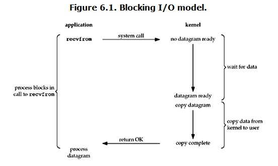
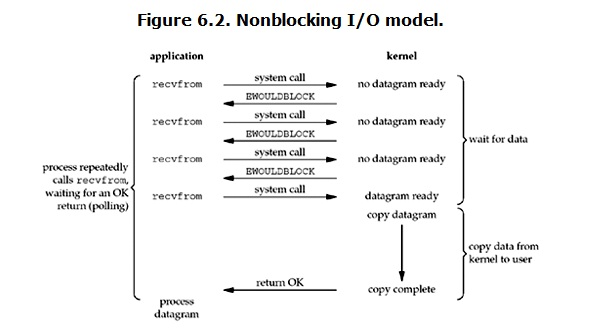
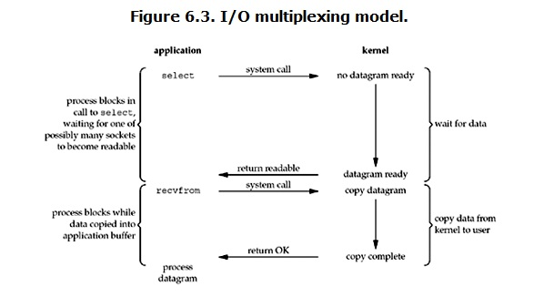
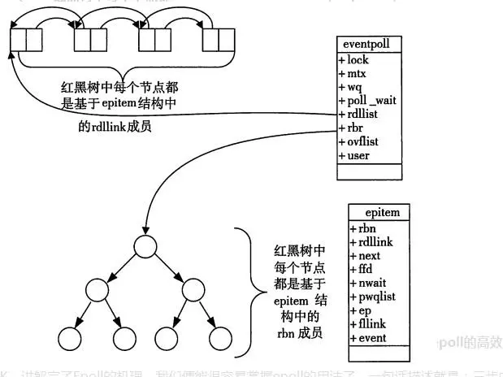
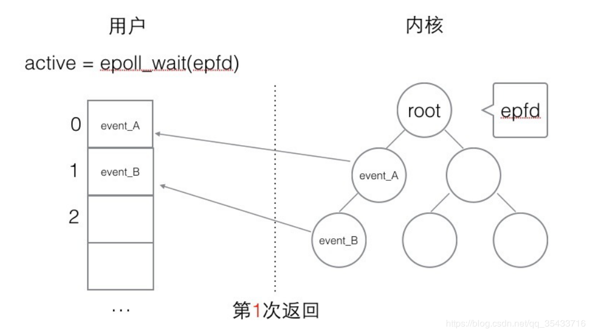
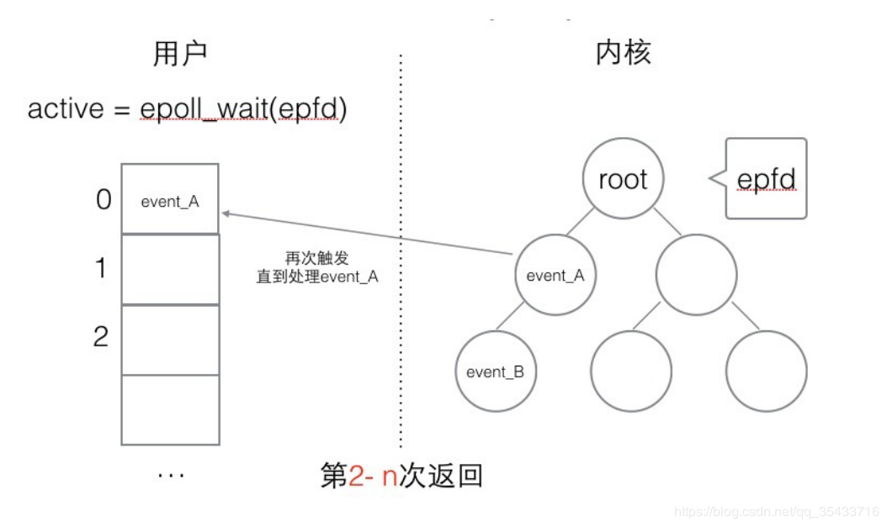
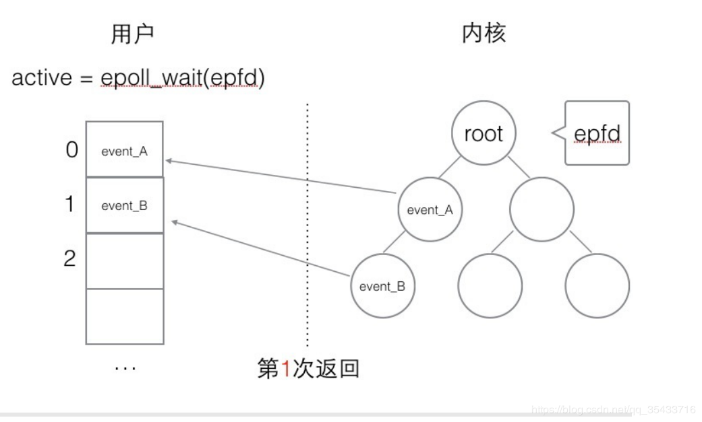
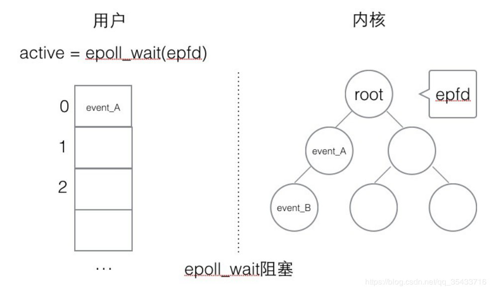
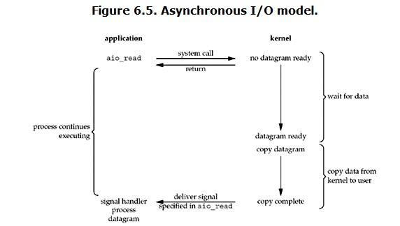

# JavaNIO

NIO并非是Java独有的概念，NIO（或Non-blocking IO）代表的一个词汇叫IO多路复用（IO Multiplexing），由操作系统提供系统调用。在Linux中最早的IO多路复用系统调用实现是 select，但由于性能低下逐渐演变为今天的基于事件驱动的epoll。掌握NIO之前需要理清几个概念：同步与异步，阻塞与非阻塞，常见的IO模型。

# 1. 同步&异步

## 1.1 同步

同步可以理解为当有多个任务需要执行时，这些任务必须逐个地进行，当一个任务完成时，下一个任务才开始执行，多个任务之间不能够并行地执行。一般而言，执行同步操作时必须要等待同步操作的结果返回才能继续执行后面的操作。

## 1.2 异步

相对于同步，异步则是当有多个任务需要执行时，这些任务可以并行地执行，无需相互等待。一般而言执行异步调用时，会立即返回，待异步操作完成后可通过状态、通知、回调等方式来通知调用者处理异步执行的结果。

## 1.3 同步IO与异步IO

根据同步的概念可知，同步IO操作是指一个线程请求IO操作时，在IO操作完成之前，该线程会被阻塞，直到IO完成并返回该线程才能继续执行。和同步与异步的关系，异步IO操作指一个线程请求IO操作时会立即返回，线程可以继续处理其他任务。当IO完毕时通过状态、通知、回调等让线程来处理IO完成的后继操作。

# 2. 阻塞&非阻塞

## 2.1 阻塞

阻塞即在执行任务的过程中发出一个请求操作，但是由于该请求操作所需要的条件不满足，那么就需要一直等待直到条件满足为止。典型的阻塞操作是需要从网络连接中读取数据，如果此时对方还没有将数据准备好，那么必须要等待对方将数据准备好并发送之后才能开始读取。

## 2.2 非阻塞

非阻塞则是在发出请求后，如果请求条件无法满足，会立即返回一个标志信息告知条件不满足，不会一直等待。非阻塞地从网络连接读取数据时，如果对方尚未准备好会立即返回一个未准备好的标志，这样就无需因为等待对方准备数据而浪费资源。

## 2.3 阻塞IO与非阻塞IO

通常而言IO主要包括对磁盘的IO、对socket的IO和对外设的IO。当用户线程发起IO操作时（主要是通过系统调用），内核会去检查需要的数据是否已经准备好。对于阻塞IO而言，如果数据没有就绪，线程会一直等待直到数据就绪。对于非阻塞IO来说，如果数据没有准备好则会返回一个标志信息告诉用户线程。当数据就绪之后，内核会将数据拷贝到用户线程并通知用户线程数据已经准备完毕。

# 3.I/O模型

## 3.1 阻塞IO（BIO）

阻塞IO是最常用也是最经典的IO模型，在Linux中，所有的socket的IO默认都是阻塞的。一个经典的阻塞IO流程如下图所示：



当用户进程调用了recvfrom系统调用时，会陷入内核态，此时内核会去检查数据是否已经准备好。对于网络IO而言，很多时候数据一开始还没有到达（比如还没有收到一个完整的TCP数据包），这个时候内核就需要等待足够多的数据。而用户线程此时也会被阻塞。

当数据准备好之后，内核会将数据从内核空间拷贝到用户空间，然后返回到用户态，让用户进程继续执行。很明显在等待数据的这段时间内，用户进行什么都不能做，造成了资源的浪费，这也是传统阻塞IO最明显的弊端。

socket编程中的accept()，recv()，send()等接口方法默认都是阻塞的，除非设置了超时或者发生了错误，否则都必须等待系统调用返回才能继续执行。

对于传统BIO的改进方案主要是利用多线程技术。一般会在服务端使用多线程，当有新的连接建立时，主线程会创建或者分配一个线程来处理这个连接，这样主线程就无需因为等待IO事件而被阻塞，继而能够继续处理其他的连接，提高系统的效率。当然这种方案明显的缺点就是，当有成千上万的请求同时到达时，会有大量的线程被创建。对于一个处理能力有限的系统而言，大量的线程之间发生切换也会导致系统效率降低，甚至是耗尽系统资源。所以一般都会通过维护一个容量有限的“线程池”或者“连接池”，超过系统的处理能力时，多余的请求将会被拒绝。

BIO+线程池的解决方法比较适合**连接数量不大**，并且**每个请求的IO比较耗时**的场景。

## 3.2 非阻塞IO（NIO）

非阻塞IO相比于传统的阻塞IO，其最大的特点就用户线程是在请求IO之后会，内核立即返回相关数据是否已经准备好的状态。一般而言，当数据没有准备好时，内核会返回一个错误信息，用户线程收到后可以知道数据暂时没准备好，可以先执行其他任务，过一段时间再向内核询问。一旦数据准备好，用户进行就可以通过系统调用陷入到内核态，内核就会将数据复制到用户进程空间并返回用户态。一个非阻塞IO的流程如下：



一般而言，非阻塞IO主要是通过轮询的方式来不断查询数据的状态，因此会导致CPU占用率上升，但系统效率并不高，这种模型也不推荐使用。轮询主要起的是检查数据是否完成，而操作系统提供了更高效的检测方式如select和poll等。

## 3.3 IO多路复用（IO Multiplexing）

IO多路复用模型则是指一个线程能够同时处理多个IO请求，基本原理主要是通过select、poll或者epoll来监控多个文件描述符的可用状态。IO多路复用的基本流程如下：



当用户进程调用select、poll、epoll等IO复用函数时，会被阻塞，同时内核会负责监视用户进程所指定的文件描述符。一旦有文件描述符就绪，内核就会将可用的文件描述符返回给用户进程。虽然这种模式和传统的BIO模型很相似，但是与BIO不同的是，用户线程可以同时监控多个文件描述符，并可以在同一个线程内完成对多个IO请求的处理，而BIO模型想要同时处理多个IO请求就必须结合多线程来使用。

IO多路复用处理多个请求时，本质上也是串行处理，因此IO多路复用模型更适合于**连接数很高但活跃的连接数比较少**，且**每次处理IO请求时间比较少**的场景，如：即时通信有大量的客户端需要和服务器建立连接，但是只有在发送消息时连接才处于活动状态，并且每次处理消息时间比较短。

对于IO操作比较耗时的场合，IO多路复用的效率未必比传统BIO+多线程的方式高，因此需要结合具体的场合来决定使用IO的模型。

### 3.3.1 什么是多路复用，复用什么？

多路复用是指多个I/O请求都共用一个逻辑流，而复用的对象一般是线程，即通过一个线程来管理多个I/O请求。

### 3.3.2 如何进行多路复用？

要对多个I/O请求进行多路复用，则要求一个线程能够对多个I/O请求进行监听。而传统的BIO模型的IO方法都是阻塞型的，因此需要引入操作系统提供的多路复用机制，即select/poll机制。

### 3.3.3 IO多路复用原理

Linux中IO多路复用的系统调用有select、poll和epoll，通过这些系统调用使得一个进程能够监听多个文件描述符就绪时间的发生。虽然IO复用能够监听多个文件描述符，但实际上监听仍然是阻塞的。当多个文件描述符就绪时，如果不进行额外的操作，那么也只能按顺序来处理这多个就绪事件，实际上也是串行工作。要实现并发，依然需要依靠多线程技术。

当用户进程调用 select，poll或epoll时，内核会去监听相关注册的文件描述符的状态，当有可用的文件描述符时，内核会返回这些文件描述符给用户进程，相比于NIO+轮询的方式，IO多路复用能够避免CPU占用过高的问题。

#### 3.3.3.1 select

```c
int select(int maxfdp1,fd_set *readset,fd_set *writeset,fd_set *exceptset,const struct timeval *timeout);
```

select基于轮询的方式来扫描文件描述符，当用户将需要监听的文件描述符添加到```fd_set```中，然后调用select。此时内核会将fd_set从用户空间拷贝到内核空间，然后遍历fd_set来检查可用的文件描述符。当有可用的文件描述符时，内核会返回可用的文件描述符个数，但是并不会指出哪些文件描述符处于可用状态。需要用户进程遍历所有文件描述符找出处于可用状态的文件描述符。

**select机制存在的问题**

- 每次调用select都需要将fd_set从用户空间拷贝到内核空间，如果fd_set很大会导致拷贝操作十分耗时。
- 每次内核都需要遍历fd_set中的所有文件描述符，如果fd_set很大，那么遍历将会十分耗时
- 内核对fd_set的大小有限制，一般在32为操作系统中最大值都是1024（在64位操作系统中是2048），只能通过多线程来提高并发量，但多线程带来的开销使得实际并发量无法达到较高的值。

#### 3.3.3.2 poll

```c
int poll(struct pollfd *fds, nfds_t nfds, int timeout);

typedef struct pollfd {
        int fd;                         // 需要被检测或选择的文件描述符
        short events;                   // 对文件描述符fd上感兴趣的事件
        short revents;                  // 文件描述符fd上当前实际发生的事件
} pollfd_t;
```

poll的实现机制与select类似，本质上没有太大的区别，也是基于轮询的方式来扫描文件描述符，但是不同点在于poll没有文件描述符的数量限制，不过poll依然没有解决select的内核拷贝与轮询的开销。

#### 3.3.3.3 epoll

epoll是在Linux内核版本2.6中正式提出，是基于事件的poll（event-based poll）。epoll与poll一样没有文件描述符数量的限制，并且epoll基于回调方式来通知内核哪些文件描述符处于就绪状态。

**epoll的三个核心API：**

```c
// epoll_create会返回一个epoll句柄，用于之后管理socket连接
// size是操作系统能够保证操作效率的最大值，超过这个值系统不保证操作效率
// 调用epoll_create的同时，内核也会创建一颗红黑树用来保存epitem和一个双链表来保存就绪的文件描述符
int epoll_create(int size);
// epfd即通过epoll_create返回的epoll句柄
// epoll_ctl可以用来添加或者删除需要监听的文件描述符，同时也会将对应的epitem添加到或者从内核中的红黑树
// 在添加新的需要监控的文件描述符时，内核会自动注册回调函数，当文件描述符就绪时，回调函数会将文件描述符添加到就绪列表中
int epoll_ctl(int epfd, int op, int fd, struct epoll_event *event);
// 用户进程通过调用epoll_wait来监听多个文件描述符，此时内核只需要检查就绪列表是否有可用的文件描述符，如果有就返回给用户进程，否则就阻塞用户进程直到有可用的文件描述符被添加到就绪列表中
int epoll_wait(int epfd, struct epoll_event * events, int maxevents, int timeout);

struct epoll_event {
	__uint32_t events; /* Epoll events */
	epoll_data_t data; /* User data variable */
};
```

**epoll的两个核心数据结构：**

当创建epoll句柄时，内核会自动创建一颗红黑树和双链表

- 红黑树：用于存储所有的通过epoll_ctl添加的epitem，这样重复监听时就避免了select和poll在调用时需要将所有的fdc重新拷贝至内核空间，提高了效率。通过epoll_ctl增加或者删除需要监听的文件描述符会对应到红黑树的插入和删除。

- 双链表：用于存储所有处于就绪状态的文件描述符。通过epoll_ctl添加需要监听的文件描述符时，也注册了回调函数，当文件描述符处于可用状态时 ，该回调函数会将文件描述符放入就绪链表当中。当调用epoll_wait方法时就会将就绪链表中的文件描述符返回给用户进程处理。

    

**触发方式：**

- 水平触发（Level Trigger LT）：当调用epoll_wait内核返回给用户进程相关的epoll_event后，如果用户没有处理该次事件，当再次调用epoll_wait时，内核依然会将上次未处理的epoll_event再次报告给用户进程。

    

    

- 边缘触发（Edge Trigger ET）：调用epoll_wait内核返回给用户进程相关的epoll_event后，不管用户是否处理了该次事件，那么再次调用epoll_wait时，先前未处理的事件将不会再次报告，除非发生新的事件。

    

    

**epoll相比于select和poll的优点：**

- 采用基于事件的回调机制，当有可用文件描述符时，回调函数会自动将可用的文件描述符添加到就绪链表上，避免了对所有文件描述符进行遍历，因此监听的效率比select和poll要高得多。
- 采用红黑树来存储所有需要监听的文件描述符，重复监听时只需要沿用已经存在的红黑树即可，无需重复将所有文件描述符拷贝到内核空间进行监听，避免了在用户空间和内核空间进行多次拷贝的开销。

**总结**

|                | select                                           | poll                                               | epoll                                                        |
| -------------- | ------------------------------------------------ | -------------------------------------------------- | ------------------------------------------------------------ |
| 监听方式       | 遍历                                             | 遍历                                               | 回调                                                         |
| 底层实现       | 数组                                             | 链表                                               | 红黑树+双链表                                                |
| IO效率         | 每次调用都要进行线性遍历，时间复杂度为O(n)       | 每次调用都要进行线性遍历，时间复杂度为O(n)         | 采用事件通知当时，当某个文件描述符就绪时，回调函数就会将文件描述符放入到就绪链表中，时间复杂度为O(1) |
| 最大监控FD数量 | 1024（32位OS）2048（64位OS）                     | 无上限                                             | 无上限                                                       |
| FD拷贝         | 每次select都需要将fd_set拷贝到内核空间中进行监听 | 每次poll都需要将所有pollfd拷贝到内核空间中进行监听 | 调用epoll_ctl时内核操作红黑树进行添加或者删除，调用epoll_wait时直接沿用现有的红黑树，无需额外拷贝 |

## 3.4 信号驱动的IO（SIGIO）

信号驱动的IO与NIO有些相似，但区别在于当数据准备好之后，内核会主动通知用户进程，而在NIO中，用户进程需要主动轮询内核来检查数据是否已经准备好。基于信号的IO流程如下：


用户进程首先需要注册对应的信号处理函数，然后发起IO请求并立即返回执行其他任务。内核收到请求后会准备数据，当数据准备好后会调用先前注册的信号处理函数来处理数据，处理完毕后通知用户进程来读取数据。

信号驱动的IO模型优势在于当数据到达之前，用户进程可以处理其他任务，而无需被阻塞，也无需像NIO模型那样不停轮询数据的状态造成CPU资源的浪费。

## 3.5 异步IO（AIO）

Linux中的异步IO从内核版本2.6开始引入，但使用较少，其具体流程如下：



当用户发起IO请求时，会立即返回并可以去做其他事情，内核接收到该请求后回去等待数据准备。当数据准备好之后，会将数据拷贝至用户空间，并在拷贝完成后向用户进程发送一个信号，通知IO请求已经完成。异步IO是唯一不阻塞用户进程的IO方式。

异步IO比较适合在消息模型中使用，在消息模型中，主线程负责不停读取并处理消息，所有的新来的消息会被放入消息队列中待主线程来处理。经典的应用就是在GUI线程中处理鼠标、键盘的输入。在鼠标键盘没有IO操作时，GUI线程可以去处理其他UI任务，而无需被阻塞。当鼠标或键盘产生输入时，会发送信号通知GUI线程进行处理。

使用异步IO有两个前提：

- 底层驱动必须有响应发送SIGIO信号的代码，这样当底层将数据准备好之后才能够发送信号通知相应的进程。
- 应用层必须进行相应的异步IO设置

## 五种I/O模型的对比

|                           | BIO                                                    | NIO                                                          | IO Multiplexing                                        | SIGIO                                                  | AIO    |
| ------------------------- | ------------------------------------------------------ | ------------------------------------------------------------ | ------------------------------------------------------ | ------------------------------------------------------ | ------ |
| I/O执行第一阶段——准备数据 | 用户进程发起IO请求，内核会阻塞用户进程并准备数据       | 用户进程发起IO请求后，内核会立即返回数据的可用状态。用线程采用轮询的方式不断查询数据是否可用，直到内核通知数据已经准备完毕 | 当没有可用的FD时，select、poll、epoll会阻塞用户进程。  | 非阻塞，当数据准备完毕后内核发送通知给用户进程         | 用户线程发起IO请求后会立即返回并处理其他任务。内核接收到请求会去执行数据的准备工作 |
| I/O执行第二阶段——数据拷贝 | 阻塞用户进程直到内核完成数据从内核空间到用户空间的拷贝 | 阻塞用户进程直到内核完成数据从内核空间到用户空间的拷贝       | 阻塞用户进程直到内核完成数据从内核空间到用户空间的拷贝 | 阻塞用户进程直到内核完成数据从内核空间到用户空间的拷贝 | 当数据准备好之后内核会主动将数据从内核空间拷贝到用户空间，然后通知用户进程数据已经准备完毕并处理可用状态 |

# 4. java.nio.Channel

在BIO中，数据的读取和写入主要是通过Stream来进行，而在NIO当中，数据的操作都是通过Channel，即通道来进行的。Stream一般来说都是单向的，使用Stream进行IO时一般都会创建一个InputStream和一个OutputStream来分别处理输入和输出。不同于Stream，Channel是双向的，既可以进行输入也可以进行输入操作。

```java
public interface Channel extends Closeable {
    boolean isOpen();
    void close();
}
```

Channel本身只是一个接口，其中只定义了检测通道是否处于打开状态的isOpen()方法和用于关闭通道的close()方法。在NIO中Channel的主要实现有以下几种：

- FileChannel：用于进行文件相关的操作

- DatagramChannel：用于处理UDP协议数据的读写

- SocketChannel：用户处理TCP协议数据的读写

- ServerSocketChannel：主要用于服务端，用来监听TCP连接请求，每个请求都会创建一个SocketChannel实例


# 5. java.nio.Buffer

在NIO中，我们不能像操作Stream那样，直接从Channel中读取数据或直接向Channel写入数据，Channel必须配合Buffer来使用。Buffer，即缓冲区，本质上只是一块内存，可供写入或者读取数据。当我们需要向Channel写入数据时，需要先写入Buffer中，然后Channel从Buffer读取。当需要从Channel读取数据时，数据会先被写入到Buffer中，然后再从Buffer中读取。

## 5.1 Buffer的基本属性

Buffer本身是一个抽象类，并提供了一些常用方法的基本实现。其中Buffer中最重要的三个属性是position、limit和capacity。这三个属性决定了我们可以向Buffer写入、读取数据的大小，以及Buffer中剩余的数据和可用大小。

Buffer使用时有两种模式——读模式和写模式。默认情况下，Buffer是处于写模式，此时可以向Buffer中写入数据。当需要从Buffer中读取数据时需要调用flip()方法。在不同模式下：position、limit和capacity所代表的含义也有所区别。

|        | position             | limit                | capacity     |
| ------ | -------------------- | -------------------- | ------------ |
| 写模式 | 当前已经写入的数据量 | 最大可写入的数据量   | Buffer的容量 |
| 读模式 | 当前已经读取的数据量 | 最多可以读取的数据量 | Buffer的容量 |


JavaNIO中对各种基本类型都提供了对应的Buffer实现：

- ByteBuffer
- MappedByteBuffer
- CharBuffer
- ShortBuffer
- IntBuffer
- LongBuffer
- FloatBuffer
- DoubleBuffer

## 5.2 Buffer的使用

Buffer的实现类本身不提供构造函数来创建缓冲区，而是通过allocate()来分配缓冲区。

# 6. java.nio.channels.Selector

