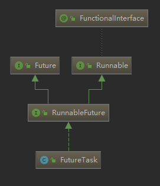
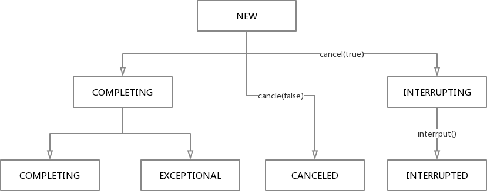
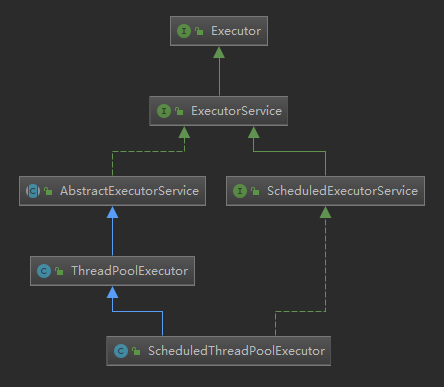
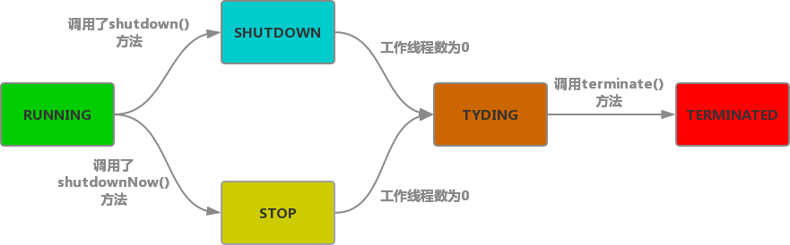
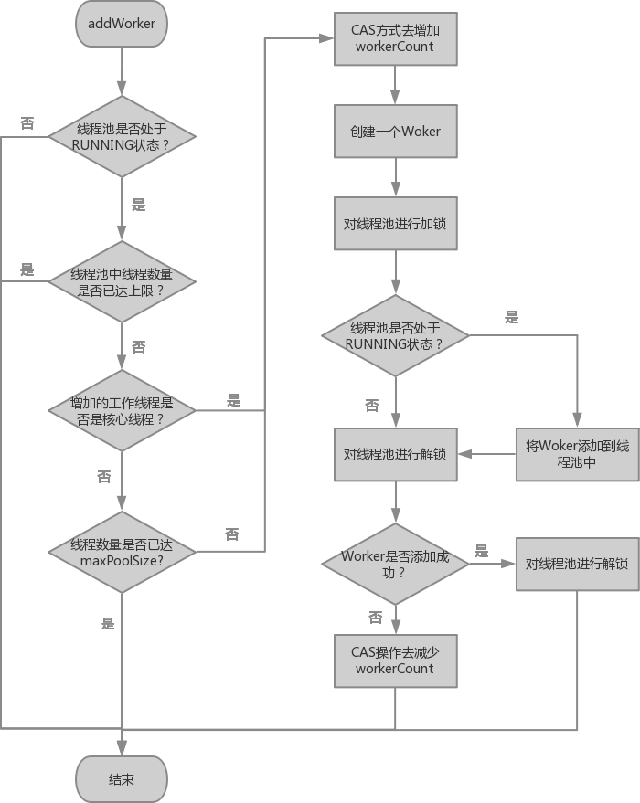

# Java并发基础

## 1. 进程与线程的区别

- 进程是资源分配的最小单位，线程是CPU调度的最小单位
- 进程有独立的地址空间，且进程之间互不影响，线程没有独立的地址空间，属于同一进程的多个线程共享同一块地址空间
- 进程切换的开销比线程切换大

## 2.Java中的进程与线程

每运行一个Java程序就会产生一个Java进程，并且该进程至少包含一个线程

每个Java进程对应一个JVM实例，多个线程共享同一个JVM堆

## 3. Java中创建线程的几种方法

-   继承Thread类，并重写run方法
-   实现Runnable接口，并将其作为参数传入到Thread类的构造方法中
-   实现Callable\<V\>接口，然后传入FutureTask类的构造方法中，并将FutureTask提交到线程池，或作为参数传入Thread的构造方法中

# 1. Java中线程相关类

## 1.1 Runnable

Runnable是一个接口，其中只声明了一个无返回值的run方法。

```java
public interface Runnable {
    void run();
}
```

## 1.2  Thread

Thread类是Java多线程的核心类，任何多线程都离不开Thread


### 1.2.1 Thread的run()方法和start()方法的区别

start()方法会调用JVM的JVM_StartThread来创建一个新的线程并调用run()方法，而run()方法只是一个普通的方法调用，并不会产生新的线程

### 1.2.2 Thread和Runnable的区别

Runnable只是一个接口，通过实现Runnable接口并不能实现一个线程。Thread实现了Runnable接口，并且新增了许多功能，Thread类通过一个本地方法start0()来实现多线程的start()方法。


 ### 1.2.3 Thread的状态

线程状态记录在Thread中的一个State枚举类，包含New、Runnable、Blocked、Waiting、Timed Waiting和Terminated六中状态。

- 新建（New）：线程被创建后尚未调用start()方法将会处于New状态
- 运行（Runnable）：包含Running和Ready两种状态

> 1. Running是线程得到CPU时间片处于的状态。
> 2. 而Ready是线程正在等待CPU时间片的状态。

- 无限期等待（Waiting）：处于此状态的线程不会得到CPU的时间片，需要被其他线程唤醒，下列方法会导致线程处于无限期等待的状态

> 1. 调用没有设置Timeout的Object.wati()方法
> 2. 调用没有设置Timeout的Thread.join()方法

- 限期等待（Timed Waiting）：处于此状态的线程在等待特定的时间后会由系统自动唤醒，下列方法会导致线程处于限期等待状态：

> 1.  Thread.sleep(long milllis)方法
> 2.  调用了设置Timeout的Object.wait(long timeout)方法
> 3.  调用了设置Timeout的Thread.join()方法
> 4.  LockSupport.parkNanos()方法
> 5.  LockSupport.parkUntil()方法

- 阻塞（Blocked）：处于此状态的线程需要等待获取排它锁，一下方法会使线程进入阻塞状态：
> 1.  尝试进入synchronized修饰的代码块或者尝试获取synchronized修饰的锁时失败的线程
> 2.  处于Waiting或Timed Waiting状态的线程被其他线程唤醒，需要重新竞争锁但没有成功的线程

- 结束（Terminated）：线程执行完成或者发生异常时所进入的终止状态，已经处于结束状态的线程无法被复活并重新运行，否则会抛出IllegalThreadStateException异常。


线程状态及转换图：


### 1.2.4 sleep()和wait()的区别

sleep()是Thread类的方法，而wait()是Object类的方法

Thread.sleep()只会让出CPU，不会释放已经获得的锁，而Object.wait()方法，不仅会让线程让出CPU，还会释放已经获得的对象锁。

### 1.2.5 Object.notify()和Object.notifyAll()的区别

在了解notify()和notifyAll()时，需要先了解锁池和等待池两个概念

**锁池（Entry List）**

当多个线程需要进入同一个对象的synchronized的方法时，没有竞争到锁的线程将会被放入该对象的锁池当中，处于锁池的线程会继续竞争对象锁。

**等待池（Wait Set）**

当某个线程调用Object.wait()方法时，该线程会释放该对象锁并被放入到该对象的等待池中，等待其他线程的唤醒。处于等待池当中的线程不会竞争该对象锁。

**Object.notify()和Object.notifyAll()**

notify()方法只会随机地唤醒等待池中的**一个线程**进入锁池来竞争对象锁

notifyAll()方法会唤醒等待池中的**所有线程**去竞争对象锁

### 1.2.6 Thread.yield()方法

调用yield()方法后，线程会通知线程调度器表明自己愿意让出CPU时间片，线程调度器接收到这个暗示后，可能会忽略该暗示，让线程继续执行。所以yield()方法不一定会产生线程间的调度，是否发生调度由线程调度器决定。

yield()方法只会让线程让出CPU时间片，而不会让出已经获得的锁

### 1.2.7 Thread.interrupt()方法

中断线程的方法可以通过调用线程的stop()方法，但是stop()方法过于粗暴，会强制停止线程的执行，导致不能清理已经申请的资源。线程被强制停止后会释放已获得的锁，可能造成数据不同步的问题。因此stop()方法在JDK1.8中已经被标记为废弃，不再建议使用。

停止线程比较温柔的方法是通过调用线程的interrupt()方法。interrupt()方法不会让线程立即停止，而是将线程的中断标记设置为true，通知线程应该中断，因此interrupt()方法并不能直接中断线程。

- 如果线程正在执行，则不会受该标记的影响。

- 如果线程处于阻塞状态，那么会立即退出阻塞状态并抛出InterruptedException异常。

一般如果一个线程有需要被中断的需求，则应当配合中断来实现。

- 在正常运行任务时，应当经常检查中断标志位，如果需要中断，则自行停止线程
- 当线程抛出InterrputedException异常时，应当正确处理该异常而不是忽视，以此来实现中断处理。

```java
new Runnable() {
    @Override
    public void run {
        try {
            while (!Thread.currentThread().isInterrupted) {
                // 正常情况下执行线程自己的业务逻辑
            }
            // 当被标记为需要中断的时候线程自行停止
        } catch (InterruptedException e) {
            // 当线程处于阻塞状态时，如果被中断，应当处理中断异常清理相关的资源，如打开的文件等
        }
    }
}
```

## 1.3 Callable\<V\>

在JDK1.5之前，我们可以通过Thread和Runnable来实现多线程，但是这两种方式都存在缺陷，即在线程执行完毕后不能返回结果，这是因为Runnable接口中只定义了一个无返回值的run方法。而从JDK1.5开始，就提供了Callable和Future两个类，可以通过他们的组合来实现线程执行完毕后返回结果。

```java
public interface Callable<V> {
    V call() throws Exception;
}
```

从Callable的源码可以看出，Callable是一个泛型接口，并且其中的call方法允许抛出异常。

### 1.3.1 Callable和Runnable的异同

相同点：

-   二者都是接口
-   二者都可以用来实现多线程
-   二者最终都需要通过Thread类来实现线程的创建

不同点：

-   Runnable接口的run方法没有返回值，而Callable接口的call有返回值，可以用来返回执行结果

-   Runnable接口的run方法不允许抛出异常，如果遇到异常必须在方法内部处理而不能向上继续抛出。而Callable接口的call方法允许将向上抛出，由外层来处理异常。

## 1.4 Future\<V\>

Future是一个接口，正如其名，Future是用来表示异步计算的未来结果，通过实现Callable接口我们可以让线程在执行完毕后返回执行结果，但是我们需要通过Future对象来获取返回的结果。即使用Callable来产生结果，Future来获取结果。

```java
public interface Future<V> {
    boolean cancel(boolean mayInterruptRunning);
    boolean isCanceled();
    boolean isDone();
    V get() throws InterruptedException, ExecutionException;
    V get(long timeout, TimeUnit unit) throws InterruptedException, ExecutionException, TimeoutException;
}
```

可以看到Future接口中定义了cancel()，isCanceled()，isDone()，get()方法。通过cancel我们可以取消一个正在执行的任务。通过isDone()来判断任务是否执行完毕。通过get()来获取任务的执行结果。

需要注意的是，如果使用五参数的get()方法则调用方将会被阻塞，直到任务执行完毕产生返回结果或者遇到异常中止。

## 1.5 FutureTask\<V\>

FutureTask实现了RunnableFuture接口，而RunnableFuture接口则同时继承了Runnable接口和Future接口，因此FutureTask既可以被当做Runnable被线程执行，又可以作为Future得到Callable的返回值，实际上FutureTask是RunnableFuture的唯一实现。



FutureTask具有两个构造函数，其中一个接受Callable任务，另一个接受Runnable任务，和需要返回的值。从构造函数的实现来看，接受Runnable的构造函数调用了Executors的callable()方法，将Runnable和返回值包装成了一个Callable对象。

FutureTask的构造函数

```java
public FutureTask(Callable<V> callable) {
    if (callable == null)
        throw new NullPointerException();
    this.callable = callable;
    this.state = NEW;
}

public FutureTask(Runnable runnable, V result) {
    this.callable = Executors.callable(runnable, result);
    this.state = NEW;
}
```

Executors中将Runnable包装为Callable的方法：

```java
public static <T> Callable<T> callable(Runnable task, T result) {
    if (task == null) 
        throw new NullPointerException();
    return new RunnableAdapter<T>(task, reuslt);
}

static final class RunnableAdapter<T> implements Callable<T> {
    final Runnable task;
    final T reuslt;
    Runnable Adapter(Runnable task, T reuslt) {
        this.task = task;
        this.result = result;
    }
    
    @Override
    public T call() {
        task.run();
        return reuslt;
    }
}
```

### 1.5.1 FutureTask的状态

-   NEW：刚创建或者处于运行状态但还未完成的FutureTask所处的状态。

-   COMPLETING：当任务执行完或者发生异常时所处的中间状态，但此时执行结果还未保存到outcome字段。

-   NORMAL：任务正常执行完毕，且执行结果已经保存到outcome字段时的状态。

-   EXCEPTIONAL：任务执行时发生异常，并且发生的异常已经保存到outcome字段，将会用COMLETING转换到此状态。

-   CANCELLED：在任务创建完或者任务正在执行时，调用了cancel(false)方法时，将会从NEW状态转换到此状态，但此时并不会中断任务执行的线程。在调用了cancle方法时，无论参数mayInterruptIfRunning是ture还是fale，如果再调用get都会抛出CancellationException异常，也就是说，一旦任务被取消，即使执行任务的线程已经执行完毕了，我们也无法获取到结果，除非任务已经完成。

-   INTERRUPTING：在任务创建完或者任务正在执行时，调用了cancel(true)方法将要中断任务线程但还没中断前，将会由NEW状态转换到此状态，此时是一个中间状态。

-   INTERUPPTED：在调用任务线程的interrupt()方法后，将会从INTERRUPTING转换到此状态。



# 2. Java8中的Unsafe类

Unsafe这个类是Java中比较特殊的类，从类名上就可以看出这个类是不安全的。Unsafe类中确实有一些不安全的操作，比如分配堆外内存，直接操作指针等，因此官方不推荐使用该类。并且该类使用了单例模式，正常情况下是无法获取到Unsafe的实例。只有由Boot ClassLoader加载的类（即Java源码中的类）才能够获取到该实例。如果确实需要使用可以通过反射的方式获取该Unsafe的实例。

```java
public static Unsafe getUnsafe() {
    // 先获取调用该方法的实例所属的类
    Class<?> caller = Reflection.getCallerClass();
    // 判断改类的类加载器是否属于系统级别的类加载器
    // 如果该类是通过Boot ClassLoader加载的，则通过getClassLoader()是获取不到类加载器的
    if (!VM.isSystemDomainLoader(caller.getClassLoader()))
        // 非Boot ClassLoader加载的类尝试获取Unsafe的实例将会抛出一个安全异常
        throw new SecurityException("Unsafe");
    return theUnsafe;
}

public static boolean isSystemDomainLoader(ClassLoader loader) {
    return loader == null;
}
```

在Java当中Unsafe类主要提供以下三种重要的操作，并且通过以下三种操作实现了绝大部分的并发框架：

- 定位对象某个字段的内存偏移量，或者对其进行修改
- 各种CAS原子操作来保证线程安全
- 对线程进行挂起或者恢复操作

## 2.1 定位对象某个字段的内存偏移量

每一个类一旦其字段确定下来，那么这个字段在该类的内存偏移量同时也就确定了。访问一个类的字段可以通过该类以及该字段的内存偏移量来进行访问。Unsafe中提供几个本地方法来获取一个字段在类中的内存偏移量：

```java
// 获取一个实例字段的内存偏移量
public native long objectFieldOffset(Field f);
// 获取一个静态字段的内存偏移量
public native long staticFieldOffset(Field f);
```

获取到字段的内存偏移量之后，可以通过Unsafe中一些操作指针的方法来修改字段的值，即便该字段被final修饰为只读。

```java
/**
 * @param o         需要修改对象（可以是类对象或者类实例）
 * @param offset    字段偏移地址
 * @param x         字段值
 */
public native void putObject(Object o, long offset, Object x);
```

简单的Demo：

```java
public class Test {
    public static void main(String[] args) throws IllegalAccessException, NoSuchFieldException {
        User user = new User("Jack");
        user.printName();
        // 通过反射获取Unsafe的实例
        Field instanceFiled = Unsafe.class.getDeclaredField("theUnsafe");
        instanceFiled.setAccessible(true);
        Unsafe unsafe = (Unsafe) instanceFiled.get(null);
        // 获取User类的name字段偏移量
        Field nameField = User.class.getDeclaredField("name");
        long fieldOffset = unsafe.objectFieldOffset(nameField);
        // 通过偏移量来修改字段值
        unsafe.putObject(user, fieldOffset, "Mary");
        user.printName();
    }
}

class User {
    private final String name;
    public User(String name) {
        this.name = name;
    }
    public void printName() {
        System.out.println("user name: " + name);
    }
}
============================== 输出 ==============================
user name: Jack
user name: Mary
```

一般直接通过字段偏移量进行设值的操作比较少，更多情况下是用于配合CAS操作。

## 2.2 ComapreAndSwap（CAS）

在操作共享变量的时候，往往需要配合锁来实现，在修改之前需要获取该变量的排它锁，并在修改完毕之后释放该锁。这种每次操作共享变时加锁的操作一般称为悲观锁，即认为在操作共享变量的时候一定会发生冲突。

而另一种锁策略则是认为在操作共享变量的时候不会发生冲突，也就所谓的**乐观锁**或者**无锁**，因为不存在加锁操作，线程可以无需被挂起而得以持续运行，一旦发生冲突就进行重试直到成功为止。CompareAndSwap即CAS就是一种无锁策略的实现，其具体思路是：在修改共享变量之前先读取该变量的值作为预期值，修改时比较当前的值与预期值，如果相同，则说明没有发生冲突，可以进行修改。如果不相同说明发生了冲突，则放弃该次修改。

在Unsafe类中提供了三种类型的CAS操作，并且CAS操作常常会配合循环来实现无锁机制，当然CAS需要配合字段偏移量一同使用。

```java
public final native boolean compareAndSwapObject(Object o, long offset,
                                                 Object expected,
                                                 Object x);

public final native boolean compareAndSwapInt(Object o, long offset,
                                              int expected,
                                              int x);

public final native boolean compareAndSwapLong(Object o, long offset,
                                               long expected,
                                               long x);
```

可以看到三种CAS操作都是通过本地方法来实现的，关于compareAndSwapInt()的C++源码如下：

```c++
UNSAFE_ENTRY(jboolean, Unsafe_CompareAndSwapInt(JNIEnv *env, jobject unsafe, jobject obj, jlong offset, jint e, jint x))
	UnsafeWrapper("Unsafe_CompareAndSwapInt");
	oop p = JNIHandles::resolve(obj);
	jint* addr = (jint *) index_oop_from_field_offset_long(p, offset);
	return (jint)(Atomic::cmpxchg(x, addr, e)) == e;
UNSAFE_END

jbyte Atomic::cmpxchg(jbyte exchange_value, volatile jbyte* dest, jbyte compare_value) {
	assert(sizeof(jbyte) == 1, "assumption.");
	uintptr_t dest_addr = (uintptr_t)dest;
	uintptr_t offset = dest_addr % sizeof(jint);
	volatile jint* dest_int = (volatile jint*)(dest_addr - offset);
	jint cur = *dest_int;
	jbyte* cur_as_bytes = (jbyte*)(&cur);
	jint new_val = cur;
	jbyte* new_val_as_bytes = (jbyte*)(&new_val);
	new_val_as_bytes[offset] = exchange_value;
	while (cur_as_bytes[offset] == compare_value) {
		// 这里的cmpxchg是通过CPU指令来实现的
		jint res = cmpxchg(new_val, dest_int, cur);
		if (res == cur) break;
		cur = res;
		new_val = cur;
		new_val_as_bytes[offset] = exchange_value;
	}
	return cur_as_bytes[offset];
}
```

可以看到该方法的实现最终是通过cmpxchg指令方法来实现的，但该指令需要CPU的支持才可以实现。通过CAS实现线程安全的更新操作大致流程如下：


CAS实现简单的线程安全自增操作：

```java
public class MiscTest {

    private static int value = 0;

    public static void main(String[] args) throws IllegalAccessException, NoSuchFieldException, InterruptedException {
        // 通过反射获取Unsafe的实例
        Field instanceFiled = Unsafe.class.getDeclaredField("theUnsafe");
        instanceFiled.setAccessible(true);
        Unsafe unsafe = (Unsafe) instanceFiled.get(null);
        // 获取value字段的偏移量
        long offset = unsafe.staticFieldOffset(MiscTest.class.getDeclaredField("value"));
        Runnable task = () -> {
            int expectedValue;
            for (int i = 0; i < 100000; i++) {
                for (; ; ) {
                    expectedValue = value;
                    if (unsafe.compareAndSwapInt(MiscTest.class, offset,
                                                 expectedValue, expectedValue + 1)) {
                        break;
                    }
                }
            }
        };
        Thread t1 = new Thread(task);
        Thread t2 = new Thread(task);
        t1.start();
        t2.start();
        t1.join();
        t2.join();
        System.out.println("value: " + value);
    }
}
============================== 输出 ==============================
value: 200000
```

## 2.3 线程挂起与恢复

在进行线程间通信时，有时可能需要让线程挂起并等待某些条件满足后再唤醒线程。虽然可以使用synchronized关键字并配合Object的wait()、notify()或nofityAll()方法来使用，但是对于需要精准控制线程的挂起和恢复时实现起来会更加复杂和困难。为了能够更好控制线程的挂起和恢复，Unsafe类中提供了一对基本的挂起与恢复操作——park和unpark。

```java
/**
 * 用于挂起线程
 * @param isAbsolute	// 如果为true则时间以毫秒计算，否则以纳秒计算
 * @param time			// 当time > 0时才设置超时时间，否则线程将被用久挂起直到被唤醒
 */
public native void park(boolean isAbsolute, long time);
/**
 * 用于唤醒线程
 * @param thread	需要唤醒的线程对象
 */
public native void unpark(Object thread);
```

### 2.3.2 park()与unpark()的底层实现原理

在Linux下，park()和unpark()方法是基于Posix线程库pthread中的mutex（互斥量）和condition（条件变量）来实现的。mutex和condition保护了一个_counter的变量，当线程调用park()时，该值将会被设置为0，当调用unpark()时，该值将会被设置为1。

Java的每一个线程都会有一个对应的Parker实例，其部分源码如下：

```c++
class Parker : public os::PlatformParker {
private:
	volatile int _counter ;	// 用来记录“许可”，为0时不可用，为1时则可用
    ...
public:
    void park(bool isAbsolute, jlong time);
    void unpark();
    ...
}

class PlatformParker : public CHeapObj<mtInternal> {  
protected:  
	pthread_mutex_t _mutex [1] ;  // 互斥量
	pthread_cond_t  _cond  [1] ;  // 条件变量
	...
}  

// park方法的实现
void Parker::park(bool isAbsolute, jlong time) {
    // park时检查_count是否可用，如果可用则无需挂起线程
    if (_counter > 0) { // no wait needed
        _counter = 0;
        OrderAccess::fence();
        return;
    }

    Thread *thread = Thread::current();
    assert(thread->is_Java_thread(), "Must be JavaThread");
    JavaThread *jt = (JavaThread *) thread;

	// 在挂起之间检查一次线程的中断状态，如果被设置中断，则立即返回
    if (Thread::is_interrupted(thread, false)) {
        return;
    }

    // Next, demultiplex/decode time arguments
    timespec absTime;
    if (time < 0) { // don't wait at all
        return;
    }
    if (time > 0) {
        unpackTime(&absTime, isAbsolute, time);
    }
    
    // 将当前线程包装成一个ThreadBlockInVM对象，即阻塞线程
    ThreadBlockInVM tbivm(jt);

    // Don't wait if cannot get lock since interference arises from
    // unblocking.  Also. check interrupt before trying wait
    // 在等待之前再次检查中断状态，如果线程被中断，或者尝试获取_mutex失败时立即返回
    if (Thread::is_interrupted(thread, false) || pthread_mutex_trylock(_mutex) != 0) {
        return;
    }
	// 如果能够运行到这里说明线程成功获取到互斥量_mutex
    int status;
    // 再次检查“许可”是否可用
    if (_counter > 0) { // no wait needed
        _counter = 0;
        status = pthread_mutex_unlock(_mutex);
        assert(status == 0, "invariant");
        OrderAccess::fence();
        return;
    }


    OSThreadWaitState osts(thread->osthread(), false /* not Object.wait() */);
    jt->set_suspend_equivalent();
    // cleared by handle_special_suspend_equivalent_condition() or java_suspend_self()

    if (time == 0) {
        // 如果是无限期挂起，则调用pthread库的pthread_cond_wait将当前线程挂起，直到其他线程通过条件变量将此线程唤醒
        status = pthread_cond_wait(_cond, _mutex);
    } else {
        // 否则通过safe_cond_timedwait方法将线程挂起直到发生超时
        // 
        status = os::Linux::safe_cond_timedwait(_cond, _mutex, &absTime);
        // 如果是限时等待，线程被唤醒后将从这里继续执行
        if (status != 0 && WorkAroundNPTLTimedWaitHang) {
            pthread_cond_destroy(_cond);
            pthread_cond_init(_cond, NULL);
        }
    }
    assert_status(status == 0 || status == EINTR ||
                  status == ETIME || status == ETIMEDOUT,
                  status, "cond_timedwait");

    _counter = 0;
    status = pthread_mutex_unlock(_mutex);
    assert_status(status == 0, status, "invariant");
    // If externally suspended while waiting, re-suspend
    if (jt->handle_special_suspend_equivalent_condition()) {
        jt->java_suspend_self();
    }

    OrderAccess::fence();
}
```

### 2.3.2 park()、unpark()与Object的wait()、nofity()、nofityAll()的区别

1. 面向的主体不一样：park()和unpark()主要是针对具体的线程进行挂起或者恢复操作，进行精准的线程控制。而wait()、nofity()、nofityAll()方法则是围绕需要被加锁的对象对线程进行挂起和恢复，其不需要nofity()的调用者明确需要具体唤醒的线程。
2. 实现的机制不同：park()和unpark()的底层在Linux下是基于Posix线程库中的mutex和condition来实现的，而wait()、nofity()、nofityAll()是基于monitor机制来实现的。

# 3. AQS队列同步器

在多线程的场景下，不可避免地需要进行线程之间的通信，而AQS（AbstractQueuedSynchronizer）框架则是由Doug Lea大神提出的一种基于CLH队列的线程同步框架，而J.U.C中的锁和同步机制几乎都是通过AQS来实现的，因此只有理解了AQS的工作原理才能对Java并发有更深入的认识，更好地掌握Java并发开发。

## 3.1 AQS.Node

AQS的主要工作原理是基于CLH队列，AQS内部维护了一个整型的同步状态waitStatus，并通过该状态来对线程进行同步管理。AQS中的CLH队列是一个FIFO的双向链表，其中链表中除了头结点以外，每一个节点包含了一个对线程的引用、当前节点的等待状态，必要时还包含condition队列中的下一个节点。

AQS中FIFO队列的Node源码：

```java
static final class Node {
    // 用来标记一个节点的类型是属于共享模式还是排他模式
    static final Node SHARED = new Node();
    static final Node EXCLUSIVE = null;
    
    static final int CANCELLED =  1;	// 表示当前节点的线程被取消
    static final int SIGNAL    = -1;	// 表示当前节点释放完状态后应该唤醒其后继节点
    static final int CONDITION = -2;	// 表示当前节点位于condition队列中
    static final int PROPAGATE = -3;	// 在共享模式下当前节点应当将同步状态传递到下一个节点，让后面的共享节点也能够成功获取到同步状态
    volatile int waitStatus;	// 当前节点的等待状态，默认值为0，表示没有后继节点
    volatile Node prev;
    volatile Node next;
    volatile Thread thread;		// 当前节点所持有的线程
    Node nextWaiter;			// condition队列中的下一个节点，否则表示下一个节点是共享模式还是排他模式
    
    final boolean isShared() {
    return nextWaiter == SHARED;
	}
    
    final Node predecessor() throws NullPointerException {
        Node p = prev;
        if (p == null)
            throw new NullPointerException();
        else
            return p;
	}
    
    Node() {    // Used to establish initial head or SHARED marker
    }
    
    Node(Thread thread, Node mode) {     // Used by addWaiter
        this.nextWaiter = mode;
        this.thread = thread;
    }
    
    Node(Thread thread, int waitStatus) { // Used by Condition
        this.waitStatus = waitStatus;
        this.thread = thread;
    }
}
```

## 3.2 AQS的同步操作

AQS提供了一些基本的操作方法来让线程之间进行同步或者互斥，这些方法使用了模板模式来进行封装，规定了获取同步状态的流程框架，并使用了final关键字进行修饰，子类不允许重写。但对于同步状态如何进行获取则交由子类进行实现，AQS本身不提供默认的实现方式。下面是AQS中暴露给外部用于获取同步状态的方法：

| 方法名                              | 作用                     |
| ----------------------------------- | ------------------------ |
| acquire(int arg)                    | 以独占模式获取同步状态   |
| acquireInterruptibly(int arg)       | 同上，但允许响应中断     |
| acquireShared(int arg)              | 以共享模式获取同步状态   |
| acquireSharedInterruptibly(int arg) | 同上，但允许响应中断     |
| release(int arg)                    | 在独占模式下释放同步状态 |
| releaseShared(int arg)              | 在共享模式下释放同步状态 |

### 3.2.1 获取同步状态

获取同步状态主要是通过acquire()和acquireShared()两个方法进行，前者是以排他模式获取同步状态，后者是以共享模式获取同步状态。

#### 3.2.1 排他模式获取同步状态

```java
public final void acquire(int arg) {
    if (!tryAcquire(arg) &&	// 先尝试获取同步状态，成功则直接返回
        acquireQueued(addWaiter(Node.EXCLUSIVE), arg))	// 失败时将进入阻塞队列进行等待
        selfInterrupt();
}
```

当一个节点需要进入队列时，将调用addWaiter()方法来进行入队操作

```java
private Node addWaiter(Node mode) {
    Node node = new Node(Thread.currentThread(), mode);
    // Try the fast path of enq; backup to full enq on failure
    Node pred = tail;
    if (pred != null) {
        // 若队列尾部不为空，则CAS尝试将当前节点设为尾部节点
        node.prev = pred;
        if (compareAndSetTail(pred, node)) {
            pred.next = node;
            return node;
        }
    }
    // 若队尾尾部为空说明当前队列尚未初始化
    // 或者CAS将当前节点设为尾部失败时，表明有竞争，需要重试
    // 初始化队列或者重试都使用enq()方法
    enq(node);
    return node;
}

private Node enq(final Node node) {
    for (;;) {
        Node t = tail;
        if (t == null) {
            // 如果队列尾部尚为空，则使用一个新的空节点来初始化队列
            // 因为AQS要求队列至少要保证有一个空节点作为头结点来存放对下一个节点的引用
            if (compareAndSetHead(new Node()))
                tail = head;
        } else {
            // 否则使用CAS尝试将当前节点放入队列尾部直到成功为止
            node.prev = t;
            if (compareAndSetTail(t, node)) {
                t.next = node;
                return t;
            }
        }
    }
}
```


acquire()方法中以排他模式来获取同步状态，其中tryAcquire()交由子类进行实现，当线程调用tryAcquire()获取同步状态失败时，将会调用acquireQueued()来进入队列来等待重新获取同步状态。

```java
final boolean acquireQueued(final Node node, int arg) {
    // 用来表示是否成功入队
    boolean failed = true;
    try {
        // 标记线程是否需要中断
        boolean interrupted = false;
        for (;;) {
            // AQS中头节点只是用来标记对下一个节点的引用，不保存其他信息
            final Node p = node.predecessor();
            // 首先判断当前节点是否是队列中的第一个节点，如果是则再次尝试获取同步状态
            if (p == head && tryAcquire(arg)) {
                // 如果当前节点是队列中的第一个节点且获取同步状态成功，则将当前节点设置为头结点
                setHead(node);
                p.next = null; // help GC
                failed = false;
                return interrupted;
            }
		   // 调用shouldParkAfterFailedAcquire()决定当前节点的线程是否应当被挂起
            // 如果需要被挂起，则调用parkAndCheckInterrupt()来挂起并检查线程的中断状态
            if (shouldParkAfterFailedAcquire(p, node) &&
                parkAndCheckInterrupt())
                interrupted = true;
        }
    } finally {
        if (failed)
            cancelAcquire(node);
    }
}
```

当一个节点中的线程需要被挂起时将调用shouldParkAfterFailedAcqure()方法进行检查，决定是否需要立即将当前节点中的线程挂起。如果需要立即挂起则调用parkAndCheckInterrupt()方法来挂起当前线程并在被唤醒后检查线程的中断状态。

```java
private static boolean shouldParkAfterFailedAcquire(Node pred, Node node) {
    // 获取前驱节点的等待状态
    int ws = pred.waitStatus;
    if (ws == Node.SIGNAL)
        // 如果前驱节点的状态为SIGNAL，说明当前节点需要被挂起，并等待前驱节点来唤醒
        return true;
    if (ws > 0) {
		// 如果前驱节点的状态为CANCEL，则向前寻找一个不为CANCEL的节点并插入到该节点之后
        do {
            node.prev = pred = pred.prev;
        } while (pred.waitStatus > 0);
        pred.next = node;
    } else {
        /*
         * 默认情况下，一个节点的waitStatus为0，表明其后没有其他节点
         * 如果此时增加一个后继节点，则那么该节点的waitStatus需要被设置为SIGNAL
         * 即该节点获取到同步状态后应当主动唤醒下一个节点。
         * 将前驱节点的waitStatus设置为SIGNAL之后会在acquireQueued()进行重试
         */
        compareAndSetWaitStatus(pred, ws, Node.SIGNAL);
    }
    return false;
}


private final boolean parkAndCheckInterrupt() {
    // 通过LockSupport的park()方法来挂起当前线程
    LockSupport.park(this);
    return Thread.interrupted();
}
```

# 4. Excutor框架与线程池

虽然Thread类为我们提供了创建异步线程的方式，但是直接创建线程也存在许多问题：

-   每次创建一个新的Thread需要耗费较多的系统资源
-   对于直接创建的线程难以进行统一管理，在高并发的情况下可能会创建大量的线程，导致OOM
-   无法灵活地对线程进行调度，比如定时、公平、中断等。
-   对于一些执行时间非常短的线程，创建线程的时间往往比执行时间要长，系统效率低下。

由于频繁地创建和销毁线程会降低系统的效率，特别是在高并发请求的环境下，服务器需要为每一个请求都分配线程，那么如果对每一个请求都去进行线程创建和销毁，会严重导致服务器性能和吞吐量下降。因此为了降低资源的消耗，提高响应速度，可以对线程进行重复利用，便有了线程池的概念。

线程池主要由两个部分组成：工作线程和阻塞队列

-   工作线程则是一组正在运行的线程，他们不断从队列中领取任务并执行
-   阻塞队列则是用于存放工作线程处理不过来的多余任务，当任务数量多余工作线程时，多余的任务会暂时存放在队列当中

Java中的线程池的实现基于Executor框架，只有对Executor框架有了深入的理解，才能更好地掌握线程池的工作原理。

J.U.C的Executor框架：



## 4.1 Executor & ExecutorService

Executor接口是整个Executor框架的根接口，其中只声明了一个execute方法，用于执行没有返回值的任务。

```java
public interface Executor {
    void execute(Runnable command);
}
```

而ExecutorService是对Executor接口的扩展，不仅提供了可以提交有返回值的submit方法，还提供了丰富的声明周期管理方法，以及可以跟踪一个或者多个异步任务执行状态的方法。如shutdown()来关闭线程池，isShutdown()来判断线程池是否关闭等。

```java
public interface ExecutorService {
    boolean awaitTermination(long timeout, TimeUnit unit) throws InterruptedException;
    <T> List<Future<T>> invokeAll(Collection <? extends Callable<T>> tasks)  throws InterruptedException;
    <T> List<Future<T>> invokeAll(Collection <? extends Callable<T>> tasks, long timeout, TimeUnit unit)  throws InterruptedException;
    <T> T invokeAny(Collection<? extends Callable<T>> tasks) throws InterruptedException, ExecutionException;
    <T> T invokeAny(Collection<? extends Callable<T>> tasks, long timeout, TimeUnit unit) throws InterruptedException, ExecutionException, TimeoutException;
    boolean isShutdown();
    boolean isTerminated();
    void shutdown();
    List<Runnable> shutdownNow();
    <T> Future<T> submit(Callable<T> task);
    Future<?> submit(Runnable task);
    <T> Future<T> submit(Runnable task, T result);
}
```

## 4.2 AbstractExecutorService

AbstractExecutorService是Executor的一个基本实现，但仍然是一个抽象类，由于AbstractExecutorService并没有Executor的execute()方法进行实现，因此无法直接被实例化作为线程池使用。AbstractExecutorService有两个支持批量提交任务的方法：invokeAll和invokeAny，调用这个两个方法的线程都会被阻塞，直到任务完成。invokeAll方法会执行全部的任务，并且需要等待全部任务都执行完毕返回，返回的是所有任务的执行结果。而invokeAny也会执行尝试执行所有任务，但如果有一个任务执行完毕，则立即将该任务的结果返回，其他任务线程的执行将会被中断。

## 4.3 ThreadPoolExecutor

ThreadPoolExecutor是对AbstractExecutorService的进一步扩充，并且完善了线程池的生命周期管理。ThreadPoolExecutor是最基本也是最重要的线程池实现之一，Executors中的各种预定义线程池基本上都是基于ThreadPoolExecutor实现的。

### 4.3.1 ThreadPoolExecutor的重要参数

```java
public ThreadPoolExecutor(int corePoolSize,
                         int maximumPoolSize,
                         long keepAliveTime,
                         TimeUnit unit,
                         BlockingQueue<Runnable> workQueue,
                         ThreadFactory threadFactory,
                         RejectedExecutionHandler handler)
```

-   **corePoolSize**（线程池核心线程数）：定义了线程池中的常驻线程数量
-   **maximumPoolSize**（线程池最大线程数）：定义了线程池中允许同时运行的最大线程数
-   **keepAliveTime**（线程最大空闲时间）：非核心线程允许的最大空闲时间，超过这个时间线程池将会将多余的线程停止
-   **unit**（空闲时间单位）：空闲时间的单位
-   **workQueue**（阻塞工作队列）：用于存放任务的阻塞队列可以选择ArrayBlockingQueue，LinkedBlockingQueue，SynchronousQueue和PriorityBlockingQueue中的一种。
-   **threadFactory**（线程工厂）：线程工厂，主要用来创建线程池中的线程，可以对线程的创建进行定制化。默认采用Executors中的defaultThreadFactory的线程工厂。
-   **handler**（线程池饱和策略）：当工作线程数达到maximumPoolSize，并且阻塞队列已满时，就会调用饱和策略。如果没指定饱和策略，默认采用AboutPolicy()直接丢弃新来的任务。

### 4.3.2 ThreadPoolExecutor的运行机制

当有新的任务提交到线程池的时候将会按下列步骤来处理任务：

1. 若线程池中的**工作线程数量 \< 核心线程数**，那么即使有空闲的线程，线程池也会创建一个新的工作线程来运行该任务
2. 若线程池中的**工作线程数量 \>= corePoolSize**，并且阻塞队列没满，那么线程池将会将任务加入到阻塞队列中
3. 若线程池中**corePoolSize \<= 工作线程数量 \< maximumPoolSize**，**且阻塞队列已满**，那么线程池将创建新的线程来处理任务
4. 若线程池中**工作线程数量已达上限**（maximumPoolSize），**且工作队列已满**，则将采取线程池饱和策略处理多余的任务

### 4.3.3 ThreadPoolExecutor的工作队列（阻塞队列）

- ArrayBlockingQueue

- LinkedBlockingQueue

- SynchronousQueue

- PriorityBlockingQueue


### 4.3.4 ThreadPoolExecutor的饱和策略

JDK中提供了四种线程池的饱和策略，分别如下：

-   AbortPolicy（默认策略）：直接抛出异常，因此调用线程池的execut()方法需要用try catch代码块，否则会造成程序退出

-   CallerRunsPolicy：使用调用者所在的线程来执行任务

-   DiscardOldestPolicy：丢弃队列中等待之间最久的任务，然后执行当前任务

-   DiscardPolicy：丢弃当前任务

如果上述饱和策略无法满足需求，可以通过实现RejectedExecutionHandler来处理线程池饱和的情况，通常这种方法最为常用。

### 4.3.5 ThreadPoolExecutor的运行状态

ThreadPoolExecutor中使用了一个原子整型类ctl来包装线程池的运行状态，并且通过这个值来控制整个线程池的运作与生命周期。

```java
/**
 * ctl用于存储线程池状态
 */
private final AtomicInteger ctl = new AtomicInteger(ctlOf(RUNNING, 0));
/**
 * COUTING_BITS表示使用多少位来存储线程数量
 */
private static final int COUNT_BITS = Integer.SIZE - 3;
/**
 * 线程池默认容量，因为使用了29位来存储，故容量为2^29 - 1
 */
private static final int CAPACITY   = (1 << COUNT_BITS) - 1;
```

在控制线程池状态的同时，还巧妙的对ctl进行了复用，不仅能够存储了线程池的当前状态，也存储了线程池中的工作线程数量。其中高3位用于存储线程池状态，低29为用于存储工作线程的数量。从ThreadPoolExecutor的源码中可以看到线程池的几种运行状态：

```java
private static final int RUNNING    = -1 << COUNT_BITS;	// 运行中
private static final int SHUTDOWN   =  0 << COUNT_BITS;	// 已关闭
private static final int STOP       =  1 << COUNT_BITS; // 已停止
private static final int TIDYING    =  2 << COUNT_BITS; // 清洁中
private static final int TERMINATED =  3 << COUNT_BITS; // 已终止
```

线程池各状态的含义如下：

- RUNNING：线程池处于运行状态中，能够接受并且处理提交到线程池的任务。

- SHUTDOWN：该状态下线程池处于关闭状态，此时线程池**不再接受新的任务，但会继续将正在运行的任务和阻塞队列中的任务完成**。处于RUNNING状态下的线程池调用shutdown()方法后会进入该状态。

- STOP：在此状态下线程池将完全停止运行任何任务，**如果仍有工作线程在工作，会尝试中断该线程**。处于RUNNING状态的线程池调用shutdownNow()方法会进入该状态。

- TYDING：线程池中已经没有工作线程即workerCount为0，池正在对有关资源进行最后的清理工作。当线程池中所有工作线程都停止后，线程池会进入该状态。

- TERMINATED：所有工作已经完成，线程池彻底关闭，准备等待被回收。

线程池状态转换图：



### 4.3.6 ThreadPoolExecutor的工作线程（Worker）

ThreadPoolExecutor中声明了一个静态内部类Worker用来实现工作线程，该Worker类继承自AQS并实现了Runnable接口，本质上是一个可运行的任务，而工作线程的工作就是不断地从任务队列中获取任务并执行，因此只要任务队列不为空，那么工作线程就应当继续工作。

ThreadPoolExecutor中的Worker构造函数：

```java
// Worker的构造函数
Worker(Runnable firstTask) {
    setState(-1); // inhibit interrupts until runWorker
    this.firstTask = firstTask;
    // 此处将worker自身包装成一个线程对象
    this.thread = getThreadFactory().newThread(this);
}
// Worker重写的run方法
public void run() {
    runWorker(this);
}
```

可以看到在Worker的构造函数中，通过线程池的线程工厂将Worker自身包装成了一个线程对象，并且Worker自身通过一个Thread类的引用来指向该包装的线程，同时重写了Runnable的run()方法来实现工作线程的启动。

#### 4.3.6.1 ThreadPoolExecutor中工作线程的添加流程

ThreadPoolExecutor中添加工作线程是通过addWorker()方法：

```java
private boolean addWorker(Runnable firstTask, boolean core) {
    retry:
    for (;;) {
        int c = ctl.get();
        int rs = runStateOf(c);
        // Check if queue empty only if necessary.
        /*
         * 判断线程池是否处于RUNNING状态
         * 或者处于SHUTDOWN状态下队列中是否还有任务
         */
        if (rs >= SHUTDOWN &&
            ! (rs == SHUTDOWN &&
               firstTask == null &&
               ! workQueue.isEmpty()))
            return false;
        // 通过CAS操作增加workerCount
        for (;;) {
            int wc = workerCountOf(c);
            if (wc >= CAPACITY ||
                wc >= (core ? corePoolSize : maximumPoolSize))
                return false;
            if (compareAndIncrementWorkerCount(c))
                break retry;
            c = ctl.get();  // Re-read ctl
            if (runStateOf(c) != rs)
                continue retry;
            // else CAS failed due to workerCount change; retry inner loop
        }
    }
    boolean workerStarted = false;
    boolean workerAdded = false;
    Worker w = null;
    try {
        // 创建一个工作线程
        w = new Worker(firstTask);
        final Thread t = w.thread;
        if (t != null) {
            final ReentrantLock mainLock = this.mainLock;
            // 加锁线程池
            mainLock.lock();
            try {
                // Recheck while holding lock.
                // Back out on ThreadFactory failure or if
                // shut down before lock acquired.
                int rs = runStateOf(ctl.get());
                // 再次判断线程池状态
                if (rs < SHUTDOWN ||
                    (rs == SHUTDOWN && firstTask == null)) {
                    if (t.isAlive()) // precheck that t is startable
                        throw new IllegalThreadStateException();
                    // 如果是线程池是RUNNING状态则将工作线程添加到线程池中
                    workers.add(w);
                    int s = workers.size();
                    if (s > largestPoolSize)
                        largestPoolSize = s;
                    workerAdded = true;
                }
            } finally {
                // 解锁线程池
                mainLock.unlock();
            }
            if (workerAdded) {
                // 工作线程添加成功并启动工作线程
                t.start();
                workerStarted = true;
            }
        }
    } finally {
        if (! workerStarted)
            // 工作线程添加失败，需要回滚对workerCount的操作
            addWorkerFailed(w);
    }
    return workerStarted;
}
```

工作线程的启动流程大致如下：



#### 4.3.6.2 ThreadPoolExecutor中工作线程的启动流程

启动工作线程时会调用Worker的run()方法，而Worker的run()方法中调用了runWorker方法，其源码如下：

```java
// Worker中的run方法
public void run() {
    runWorker(this);
}

// ThreadPoolExecutor中的runWorker方法
final void runWorker(Worker w) {
    /*
     * 在addWorker中其他线程会调用t.run()方法来启动工作线程
     * 而中作线程中的run方法又调用了此方法，因此调用runWorker()方法的线程
     * 其实就是工作线程自己，所以 wt 就指工作线程
     */
    Thread wt = Thread.currentThread();
    Runnable task = w.firstTask;
    w.firstTask = null;
    w.unlock(); // allow interrupts
    // 用来标记线程是否被强行中断
    boolean completedAbruptly = true;
    try {
        /* 核心线程能够被阻塞的机制在于getTask()方法中 */
        while (task != null || (task = getTask()) != null) {
            w.lock();
            // If pool is stopping, ensure thread is interrupted;
            // if not, ensure thread is not interrupted.  This
            // requires a recheck in second case to deal with
            // shutdownNow race while clearing interrupt
            if ((runStateAtLeast(ctl.get(), STOP) ||
                 (Thread.interrupted() &&
                  runStateAtLeast(ctl.get(), STOP))) &&
                !wt.isInterrupted())
                wt.interrupt();
            try {
                beforeExecute(wt, task);
                Throwable thrown = null;
                try {
                    // 在这里执行从任务队列中获取的任务
                    task.run();
                } catch (RuntimeException x) {
                    thrown = x; throw x;
                } catch (Error x) {
                    thrown = x; throw x;
                } catch (Throwable x) {
                    thrown = x; throw new Error(x);
                } finally {
                    afterExecute(task, thrown);
                }
            } finally {
                task = null;
                w.completedTasks++;
                w.unlock();
            }
        }
        completedAbruptly = false;
    } finally {
        // 处理工作线程结束的事件
        processWorkerExit(w, completedAbruptly);
    }
}
```

#### 4.3.6.3 工作线程的保活机制

在创建ThreadPoolExecutor时，如果指定的核心线程数不为0，线程池则会让指定数量的核心线程一直运行，而ThreadPoolExecutor中能够**使得核心线程在没有任务时也能够一直运行的机制则是通过阻塞队列来实现的**。在runWorker()方法中，工作线程会不断地从工作队列中获取任务，通过getTask()方法来获取任务。

```java
// TheadPoolExecutor的runWorker()方法
final void runWorker(Worker w) {
	...
    try {
        /* 核心线程能够被阻塞的机制在于getTask()方法中 */
        while (task != null || (task = getTask()) != null) {
            ...
        }
        ...
    } finally {
        ...
    }
}

// TheadPoolExecutor的getTask()方法
private Runnable getTask() {
    boolean timedOut = false; // Did the last poll() time out?
    for (;;) {
        int c = ctl.get();
        int rs = runStateOf(c);
        // Check if queue empty only if necessary.
        if (rs >= SHUTDOWN && (rs >= STOP || workQueue.isEmpty())) {
            decrementWorkerCount();
            return null;
        }
        int wc = workerCountOf(c);
        // Are workers subject to culling?
        // 是否允许核心线程被停止
        boolean timed = allowCoreThreadTimeOut || wc > corePoolSize;
        // 如果线程池中的线程数超过设置的最大线程数，则停止当前线程
        if ((wc > maximumPoolSize || (timed && timedOut))
            && (wc > 1 || workQueue.isEmpty())) {
            if (compareAndDecrementWorkerCount(c))
                return null;
            continue;
        }
        try {
            Runnable r = timed ?
                workQueue.poll(keepAliveTime, TimeUnit.NANOSECONDS) :
                    /*
                     * 没有允许核心线程超时的情况下会调用阻塞队列的take()方法
                     * 当阻塞队列为空时，take()方法会使调用的线程无限阻塞下去
                     * 从而实现核心线程的保活
                     */
                    workQueue.take();
            if (r != null)
                return r;
            timedOut = true;
        } catch (InterruptedException retry) {
            timedOut = false;
        }
    }
}

// LinkedBlockingQueue的take()方法
public E take() throws InterruptedException {
    return takeFirst();
}

// LinkedBlockingQueue的takeFirst()方法
public E takeFirst() throws InterruptedException {
    final ReentrantLock lock = this.lock;
    lock.lock();
    try {
        E x;
        while ( (x = unlinkFirst()) == null)
            /*
             * 当队列为空时，调用take()的线程将会调用notEmpty的await()方法
             * 而notEmpty为一个Condition对象，其await()操作会将线程挂起
             */
            notEmpty.await();
        return x;
    } finally {
        lock.unlock();
    }
}
```


## 4.4 ScheduledThreadPoolExecutor

ScheduledThreadPoolExecutor继承自ThreadPoolExecutor，并且加入了各种调度策略来实现线程池周期性地执行任务。


## 4.5 Executors中提供的线程池

为了简化线程池的使用和创建，JDK中的Exectutors中为我们提供了一些线程池的实现

### 4.5.1 Executors.newCachedThreadPool（创建一个可缓存的线程池）:

```java
public static ExecutorService newCachedThreadPool() {
    return new ThreadPoolExecutor(0, Integer.MAX_VALUE,
                              60L, TimeUnit.SECONDS,
                              new SynchronousQueue<Runnable>());
}

public static ExecutorService newCachedThreadPool(ThreadFactory threadFactory) {
    return new ThreadPoolExecutor(0, Integer.MAX_VALUE,
                                 60L, TimeUnit.SECONDS,
                                 new SynchronousQueue<Runnable>(),
                                 threadFactory);
}
```

从源码中可以看出来，可缓存的线程池实际上是创建了一个无界的ThreadPoolExecutor，允许的线程数量上限为Integer.MAX_VALUE。该线程池没有核心线程，因此能够灵活进行回收和扩展，每个线程最大的空闲时间为60秒。

### 4.5.2 Executors.newFixedThreadPool（创建一个线程数量固定的线程池）

```java
public static ExecutorService newFixedThreadPool(int nThreads) {
    return new ThreadPoolExecutor(nThreads, nThreads,
                                 0L, TimeUnit.MILLISECONDS,
                                 new LinkedBlockingQueue<Runnable>());
}

public static ExecutorService newFixedThreadPool(int nThreads, ThreadFactory threadFactory) {
    return new ThreadPoolExecutor(nThreads, nThreads,
                                 0L, TimeUnit.MILLISECONDS,
                                 new LinkedBlockingQueue<Runnable>(),
                                 threadFactory);
}
```

从源码中可以看出来，该线程池实际上是创建了一个核心线程数与最大线程数相同的线程池，每次最多启动nThread个线程，并且线程池会保持这个数量不变，线程池暂时无法处理的任务则是用了LinkedBlockingQueue来进行保存。

### 4.5.3 Excutors.newScheduledThreadPool（创建一个计划任务线程池）

```java
public static ExecutorService newScheduledThreadPool(int corePoolSize) {
    return new ScheduledPoolExecutor(corePoolSize);
}

public static ExecutorService newScheduledThreadPool(
    int corePoolSize, ThreadFactory threadFactory) {
    return new ScheduledPoolExecutor(corePoolSize, threadFactory);
}
```


### 4.5.4Executors.newSingeThreadExecutor（创建一个单线程的线程池）

```java
public static ExecutorService newSingleThreadExecutor() {
    return new FinalizableDelegatedExecutorService
        (new TheadPoolExecutor(1,1,
                              0L, TimeUnit.MILLISECONDS,
                              new LinkedBlockingQueue<Runnable>()));
}

public static ExecutorService newSingleThreadExecutor(ThreadFactory threadFactory) {
    return new FinalizableDelegatedExecutorService
        (new TheadPoolExecutor(1,1,
                              0L, TimeUnit.MILLISECONDS,
                              new LinkedBlockingQueue<Runnable>(),
                              threadFactory));
}
```


### 4.5.5 Executors.newWorkStealingPool（创建一个窃取式的线程池）

```java
public static ExecutorSevice newWorkStealingPool() {
	return new ForkJoinPool
        (Runtime.getRuntime().availableProcessors(),
        ForkJoinPool.defaultForkJoinWorkerThreadFactory,
        null, true);
}

public static ExecutorService newWorkStealingPool(int parallelism) {
    return new ForkJoinPool
        (parallelism,
        ForkJoinPool.defaultForkJoinWorkerThreadFactory,
        null, true);
}
```


# 5. synchronized关键字

首先synchronized不是对代码进行加锁，而是对对象进行加锁，synchronized获取的锁可以分为对象锁和类锁。类的锁实际也是通过对象锁来实现的，每一个类都会对应一个Class实例，对类进行加锁也就是对该类的Class实例进行加锁

获取对象锁的方法，可以用同步代码对实例进行加锁块或者声明非静态同步方法

```java
// 使用同步代码块对对象进行加锁
synchronized (obj) {
    // 需要同步的代码
}

// 声明同步非静态方法对实例进行加锁
public synchronized void method () {
    // 需要同步的代码
}
```

获取类锁的方法，可以使用同步代码块类进行加锁或者声明静态同步方法

```java
// 使用同步代码块对对类进行加锁
synchronized (A.class) {
    // 需要同步的代码
}

// 声明静态同步方法对类进行加锁
public static synchronized void method() {
    // 需要同步的代码
}
```

## 1. synchronized的实现原理

synchronized的是通过对象头中的Mark Word和Monitor机制来实现的。synchronized使用的锁会记录在对象头的Mark Word当中。Mark Word用于存储对象运行时的数据，如HashCode、GC分代年龄、锁状态、线程持有的锁等。通过不同的锁标志来区分锁的类型。

Mark Word的结构：

<table>
    <tr>
        <td rowspan="2">锁状态</td>
        <td colspan="2">25bit</td>
        <td rowspan="2">4bit</td>
        <td>1bit</td>
        <td>2bit</td>
    </tr>
    <tr>
        <td>23bit</td>
        <td>2bit</td>
        <td>是否是偏向锁</td>
        <td>锁标志位</td>
    </tr>
    <tr>
        <td>无锁</td>
        <td colspan="2">对象的HashCode</td>
        <td>分代年龄</td>
        <td>0</td>
        <td>01</td>
    </tr>
    <tr>
        <td>偏向锁</td>
        <td>线程ID</td>
        <td>Epoch</td>
        <td>分代年龄</td>
        <td>1</td>
        <td>01</td>
    </tr>
    <tr>
        <td>轻量级锁</td>
        <td colspan="4">指向栈中锁记录的指针</td>
        <td>00</td>
    </tr>
    <tr>
        <td>重量级锁</td>
        <td colspan="4">指向重量级锁的指针</td>
        <td>10</td>
    </tr>
    <tr>
        <td>GC标记</td>
        <td colspan="4">空</td>
        <td>11</td>
    </tr>
</table>

而Monitor机制则是指任何一个对象都会有一个Monitor与之关联，当且一个Monitor被持有后，它将处于锁定状态。在字节码方面，使用synchronized的同步代码块的字节码前后会被插入monitorenter和monitorexit指令，通过monitorenter来获得Monitor对象，通过monitorexit来释放Monitor对象。而使用synchronized修饰的关键字则会在该方法的字节码的标志位中增加ACC_SYNCRHONIZED标志。JVM每次调用方法时会检查该标志位是否存在，如果存在则表明需要获得Monitor对象，才能进入该方法。

```java
public void method1 () {
    synchronized (this) {
        System.out.println("Hello");
    }
}
// method1的字节码
public void method1();
    descriptor: ()V
    flags: ACC_PUBLIC
    Code:
      stack=2, locals=3, args_size=1
         0: aload_0
         1: dup
         2: astore_1
         3: monitorenter					// 通过monitorenter来获得Monitor对象
         4: getstatic     #2                  // Field java/lang/System.out:Ljava/io/PrintStream;
         7: ldc           #3                  // String Hello
         9: invokevirtual #4                  // Method java/io/PrintStream.println:(Ljava/lang/String;)V
        12: aload_1
        13: monitorexit						// 通过monitorenter来释放Monitor对象
        14: goto          22
        17: astore_2
        18: aload_1
        19: monitorexit			// 编译器自动插入的，在代码执行发生异常时会在这里释放Monitor对象
        20: aload_2
        21: athrow
        22: return
```

```java
public synchronized void method2 () {
    System.out.println("Hello");
}

// method2的字节码
 public synchronized void method2();
    descriptor: ()V
    flags: ACC_PUBLIC, ACC_SYNCHRONIZED		// 方法标志位中有ACC_SYNCHRONIZED标志
    Code:
      stack=2, locals=1, args_size=1
         0: getstatic     #2                  // Field java/lang/System.out:Ljava/io/PrintStream;
         3: ldc           #3                  // String Hello
         5: invokevirtual #4                  // Method java/io/PrintStream.println:(Ljava/lang/String;)V
         8: return
```

在Hotspot虚拟机中，Monitor机制是通过ObjectMonitor来实现的，ObjectMonitor中维护了一个EntryList即锁池和WaitSet即等待池。ObjectMonitor锁的竞争过程：

1. 所有到达的线程都会被放入到EntryList中去竞争锁
2. ObjectMonitor会将Owner标记为竞争成功的线程，并且将count+1
3. 如果线程调用了Object.wait()方法，将会释放Monitor并放入到WaitSet等待池中，等待其他线程唤醒
4. 当其他线程调用了Object.notify()或者Object.notifyAll()方法时，处于WaitSet中的进程将会重新尝试获得Monitor对象
5. 当线程执执行完同步代码块后，便会释放Monitor对象。


## 2. JDK1.6对synchronized关键字的优化

从JDK1.6开始以后对synchronized关键字进行了优化，引入了偏向锁、轻量级锁、锁消除和锁粗化等技术。竞争锁的时候根据竞争的激烈程度，JVM会逐渐升级锁的级别，从无锁→偏向锁→轻量级锁→重量级锁。锁的升级离不开Mark Word的支持。

### 无锁

没有锁的时候，这就是一个普通的对象，Mark Word记录对象的HashCode，锁标志位是01，是否偏向锁那一位是0。

### 偏向锁（适合没有或非常少竞争锁的场合）

经过研究发现，在大多数情况下，锁不仅不存在多线程竞争，而且总是由同一线程多次获得，因此为了减少同一线程获取锁（会涉及到一些CAS操作且比较耗时）的代价而引入偏向锁。**偏向锁的核心思想是，如果一个线程获得了锁，那么锁就进入偏向模式，此时Mark Word的结构也变为偏向锁结构，当这个线程再次请求锁时，无需再做任何同步操作，即获取锁的过程，这样就省去了大量有关锁申请的操作，从而也就提供程序的性能。**所以，对于没有锁竞争的场合，偏向锁有很好的优化效果，毕竟极有可能连续多次是同一个线程申请相同的锁。但是对于锁竞争比较激烈的场合，偏向锁就失效了，因为这样场合极有可能每次申请锁的线程都是不相同的，因此这种场合下不应该使用偏向锁，否则会得不偿失，需要注意的是，偏向锁失败后，并不 会立即膨胀为重量级锁，而是先升级为轻量级锁。

### 轻量级锁（适合交替执行同步块的情况）

倘若偏向锁失败，虚拟机并不会立即升级为重量级锁，它还会尝试使用一种称为轻量级锁的优化手段(1.6之后加入的)，此时Mark Word 的结构也变为轻量级锁的结构。轻量级锁能够提升程序性能的依据是“对绝大部分的锁，在整个同步周期内都不存在竞争”，注意这是经验数据。需要了解的是，轻量级锁所适应的场景是线程交替执行同步块的场合，如果存在同一时间访问同一锁的场合，就会导致轻量级锁膨胀为重量级锁。

### 自旋锁

轻量级锁失败后，虚拟机为了避免线程真实地在操作系统层面挂起，还会进行一项称为自旋锁的优化手段。这是基于在大多数情况下，线程持有锁的时间都不会太长，如果直接挂起操作系统层面的线程可能会得不偿失，毕竟操作系统实现线程之间的切换时需要从用户态转换到核心态，这个状态之间的转换需要相对比较长的时间，时间成本相对较高，因此自旋锁会假设在不久将来，当前的线程可以获得锁，因此虚拟机会让当前想要获取锁的线程做几个空循环(这也是称为自旋的原因)，一般不会太久，可能是50个循环或100循环，在经过若干次循环后，如果得到锁，就顺利进入临界区。

### 自适应自旋锁

自旋锁在JDK1.4中就引入了，但默认是关闭的，用户可以使用JVM启动数-XX:+UseSpinning来开启自旋锁，并通过参数-XX:PreBlockSpin来指定自旋的次数。但由于自旋锁的自旋数是固定的，在实际开发当中，对于自旋的次数难以把握，因此JDK1.6中引入了适应性自旋锁。自适应自旋锁的自旋次数会根据前一次在同一个锁上自旋的时间以及锁的拥有者决定的。如果在同一个锁对象上，自旋等待是刚刚被获取过的锁，并且持有锁的线程正在运行当中，那么JVM就认为这次自旋很有可能是成功的，那么将会允许自旋等待更长的时间。反之，对于一个锁，如果自旋很少成功过，那么JVM就会认为自旋没有必要，以后再获取锁的时候很有可能直接省略掉该过程，直接将线程阻塞。避免浪费处理器资源。

### 重量级锁

自旋锁重试之后如果抢锁依然失败，同步锁会升级至重量级锁，锁标志位改为10。在这个状态下，未抢到锁的线程都会被阻塞。

### 锁消除

在JIT编译时，编译器会对运行的上下文进行扫描，对于某些没必要的加锁操作，如：对局部变量的加锁，编译器会进行优化，去除加锁的操作，避免没必要的加锁产生额外的开销。

### 锁粗化

通常情况下，使用synchronized关键字进行加锁时，加锁的粒度应当尽可能的小，避免过粗的粒度而产生额外的加锁开销。但在运行的时候，如果JVM检测到同一个对象被频繁的进行加锁操作甚至是加锁操作出现在循环体当中，那么JVM就会尝试扩大加锁的范围，避免频繁的加锁造成不必要的开销。

# 6. volatile关键字

要了解volatile关键字的工作原理就必须先弄清楚Java的内存可见性和Java内存模型的相关概念

**内存可见性**：所谓内存可见性就是指一个线程对共享变量的修改能够被其他线程看见

## 6.1 Java内存模型（JMM）

Java内存模型本身是一个抽象的概念，实际上并不存在。其描述的是一组规则或规范，通过这些规则或规范定义了程序中的各个变量的访问方式。JMM主要是围绕如何处理原子性、可见性和有序性这三个特性来建立的。Java当中的基本工作单位是线程，每创建一个线程，JVM都会为之创建一个线程工作空间。在JVM中，所有的变量都存储在主内存当中，如果一个线程需要读取或者修改某个变量，则必须先将该变量拷贝到自己的工作内存当中，在工作内存中完成操作后再写回到主内存当中。而工作内存属于线程私有的区域，不同线程之间的工作内存不允许相互访问，如果线程间需要通信，则必须通过主内存来完成。


## 6.2 happens-before规则

由于编译器在编译时会对代码进行优化和重排序，但重排序需要遵循一定的规则，否则重排序将会导致程序不按照我们所指定的逻辑运行。指令重排序需要满足以下两个条件：

- 在单线程环境下不能改变程序运行的结果
- 存在数据依赖关系的不允许重排序 

重排序时所遵循的这些规则就是happens-before规则，任意两条指令在经过重排序后都不能违反任意一条happends-before原则。**happens-before八大原则：**

1. 程序顺序规则：一个线程内，按照代码顺序，书写在前面的操作happends-before书写在后面的操作。
2. 监视器锁规则：对于一个锁的解锁操作，happens-before随后对于这个锁的加锁操作。
3. volatile变量规则：对于一个volatile域的写操作，happens-before任意后续对于这个volatile域的读操作。
4. 传递性：如果A操作happens-before于B操作，B操作happens-before于C操作，则A操作happens-before于C操作。
5. 线程启动规则：一个线程的start()操作happens-before于这个线程的所有操作。
6. 线程中断规则：对线程的interrupt()的操作happens-before于被中断线程的代码检测到中断事件的发生。
7. 线程终结规则：一个线程中的所有操作都happens-before于线程的终止检测。
8. 对象终结规则：一个对象的初始化完成happens-before这个对象的finalize()方法开始。

## 6.3 java内存屏障

由于现代的操作系统中拥有多个CPU，而每个CPU都拥有自己的缓存，并且这些缓存并不是实时都与内存发生信息交换的。这样就可能出现一个CPU的缓存数据与另一个CPU的缓存数据不一致的问题，在多线程开发中，就会出现一些缓存一致性的问题，使得程序出现一些异常行为。并且加上指令重排序的问题，使得并发之下的程序运行结果难以预测。

为了解决内存可见性问题，JVM提供了一些内存屏障操作来防止缓存不一致的问题。所谓内存屏障（Memory Barrier）是一种特殊的CPU指令，它能够保证一些特定操作的执行顺序。目前JVM主要使用了4中内存屏障来禁止某些指令的重排序，从而保证内存可见性：

1. LoadLoad屏障：LoadLoad屏障确保了在该屏障之前的读操作都先于该屏障后的所有读操作的完成。对于语句Load1 | LoadLoad屏障 | Load2，能够保证Load1需要读取的数据先于Load2要读取的数据完成。
2. StoreStore屏障：StoreStore屏障确保了在该屏障之前的写操作先于该屏障后的读操作完成。对于语句Store1 | StoreStore屏障 | Store2，能够保证Store1的写入操作先于Store2完成，即Store1操作对其他线程是可见的。
3. LoadStore屏障：LoadStore屏障确保了在该屏障之前的读操作先于该屏障后面的写操作发生。对于语句Load1 | LoadStore屏障 | Store1，能够保证Load1的读操作在Store1的写入操作之前完成，即Store2操作被刷新到主内存之前，Load1的读取操作已经完毕。
4. StoreLoad屏障：StoreLoad屏障确保了在该屏障之前的写操作先于该屏障后的读操作发生。对于语句Store1 | StoreLoad屏障 | Load1，能够保证在Load1以及之后的所有读操作执行之前，Store1修改的共享变量已经被刷新到主内存中，保证Store1的操作对其他处理器是可见的。

## 6.4 synchronized和volatile关键字的内存可见性

### 6.4.1 synchronized是如何实现内存可见性的

JMM对synchronized关键字有两条规定：

- 线程解锁前，必须将共享变量的值刷新到主内存当中

- 线程加锁时，将清空工作内存中共享变量的值，在使用共享变量时就需要从主内存中重新获取最新的值

### 6.4.2 volatile是如何实现可见性的

简单来说一个线程去访问被volatile修饰的变量时，必须重新从主内存读取该内存的值，而修改该变量的值的时候必须立即将修改后的值刷新到主内存当中，这样不同的线程总是能够看到该变量最新的值。

深入来看，volatile关键字通过加入了内存屏障和禁止指令重排序优化来实现的。在JVM中，volatile的屏障策略非常保守，主要如下：

- 对于每一个volatile写操作之前，编译器会在该写操作之前插入一个StoreStore屏障，在该写操作后会插入一个StoreLoad屏障
- 对于每一个volatile读操作之前，编译器会在该读操作之前插入一个LoadLoad屏障，在该读操作后会插入一个LoadStore屏障。