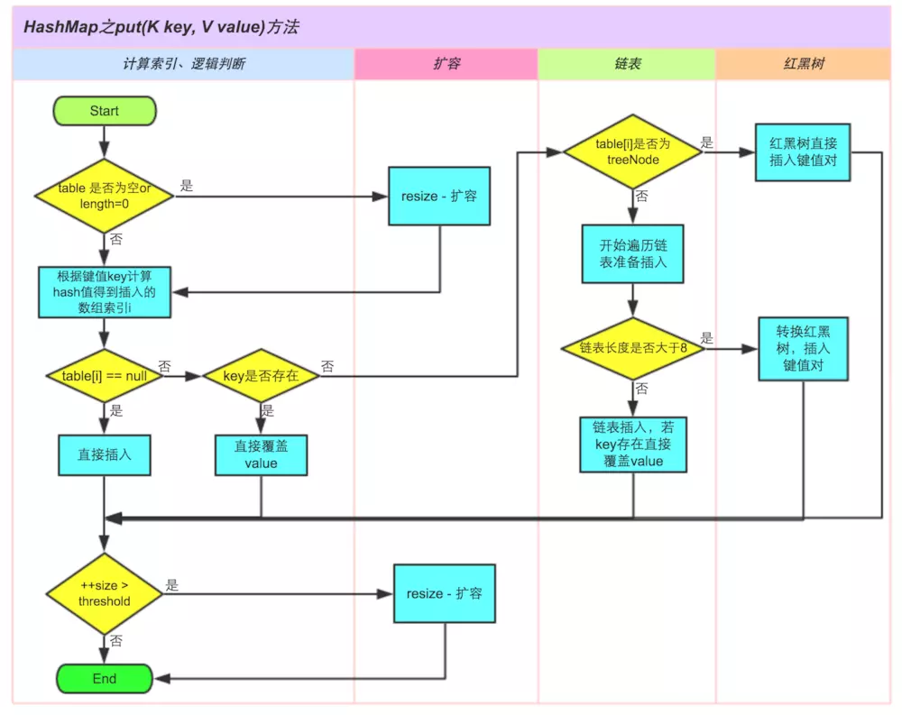

# Java集合类

## List\<T\>：有序集合，可重复，继承自Collection接口

- ArrayList\<T\>：基于数组的列表，随机访问快，插入删除效率低、非线程安全
- LinkedList\<T\>：基于单链表的列表，插入删除快，随机访问效率低、非线程安全
- Vector\<T\>：早期的ArrayList，随机访问快、线程安全、各方法采用了sychronized关键字，效率低不推荐使用
- Stack\<T\>：继承自Vector，实现基本的栈功能

## Set\<T\>：无序集合，不可重复，继承自Collection接口

- HashSet\<T\>：内部采用了HashMap来实现、因此是非线程安全的

- LinkedHashSet\<T\>：在HashSet的基础上增加了链表来保存插入顺序，遍历时将会按插入顺序进行遍历

- TreeSet\<T\>：使用二叉树存储，对插入的值按键进行排序

## Map\<K, V\>：键值对存储，键唯一，值不唯一，没有继承Collection接口，但也定义了一些与Collection接口相同的方法

-   HashMap\<K, V\>：键可空，无序、线程不安全，默认容量16，默认加载因子0.75
-   LinkedHashMap\<K, V\>：在HashMap的基础上增加了链表来保存元素的插入顺序，遍历时将会按插入顺序进行遍历
-   ConcurrentHashMap\<K, V\>：键非空、线程安全、JDK1.8中使用CAS来实现并发控制，默认容量16
-   HashTable\<K, V\>：键非空、线程安全、各方法采用了sychronized关键字，默认容量11，默认加载因子0.75
-   TreeMap\<K, V\>：有序（指的是添加元素的key是经过排序的）

## Queue\<T\>：队列集合，能够实现队列的基本操作

- ArrayDeque\<T\>：基于数组实现的双端队列
- LinkedList\<T\>：基于链表实现的双端队列
- PriorityQueue\<T\>：基于堆实现的优先队列，可以指定排序方法

# 1. List\<T\>有序列表类

## 1.1 java.util.ArrayList

### 1.1.1 基本原理和特点

原理：ArrayList是基于数组来实现的，其内部维护了一个elementData的Object数组来存放对象，因为Java的泛型是通过泛型擦除来实现的，只在编译的时候进行泛型检查，编译后泛型便被擦除，因此Array内部的数组类型是Object类。

特点：由于ArrayList是基于数组实现的，因此在随机访问上效率高，但是在插入删除方面由于需要移动元素，因此效率较差。

### 1.1.2 ArrayList中的一些默认值

| 字段              | 值                    | 说明                                                         |
| ----------------- | --------------------- | ------------------------------------------------------------ |
| DEFAULT_CAPACITY  | 10                    | ArrayList的默认容量，仅在扩容时使用，如果扩容的容量比该值小，则使用默认容量作为扩容容量 |
| EMPTY_ELEMENTDATA | {}                    | 当没有指定ArrayList的容量时，ArrayList内部数组的默认值       |
| MAX_ARRAY_SIZE    | Integer.MAX_VALUE - 8 | ArrayList的最大容量，为何需要减8，在该字段的注释中指明了某些JVM当中需要为array保留一些首部，如果尝试分配比该值更大的数组可能引发OOM |

默认值的源码：

```java
private static final int DEFAULT_CAPACITY = 10;

private static final Object[] EMPTY_ELEMENTDATA = {};
/**
 * The maximum size of array to allocate.
 * Some VMs reserve some header words in an array.
 * Attempts to allocate larger arrays may result in
 * OutOfMemoryError: Requested array size exceeds VM limit
 */
private static final int MAX_ARRAY_SIZE = Integer.MAX_VALUE - 8;
```

### 1.1.3 ArrayList的扩容

当插入元素时，ArrayList会进行计算，如果插入元素后的容量比当前容量大，则需要进行扩容。如果需要扩容，则扩容后的容量约为扩容前的1.5倍，其源码如下：

```java
public boolean add(E e) {
    // 确保插入时容量是足够的
    ensureCapacityInternal(size + 1);
    elementData[size++] = e;
    return true;
}

private void ensureCapacityInternal(int minCapacity) {
    ensureExplicitCapacity(calculateCapacity(elementData, minCapacity));
}

// 对容量进行计算，判断是否需要扩容
private static int calculateCapacity(Object[] elementData, int minCapacity) {
    if (elementData == DEFAULTCAPACITY_EMPTY_ELEMENTDATA) {
        return Math.max(DEFAULT_CAPACITY, minCapacity);
    }
    return minCapacity;
}

private void ensureExplicitCapacity(int minCapacity) {
    modCount++;
    // overflow-conscious code
    if (minCapacity - elementData.length > 0)
        grow(minCapacity);
}

// 扩容方法
private void grow(int minCapacity) {
    // overflow-conscious code
    int oldCapacity = elementData.length;
    // 扩容后的容量约为扩容前的1.5倍
    int newCapacity = oldCapacity + (oldCapacity >> 1);
    if (newCapacity - minCapacity < 0)
        newCapacity = minCapacity;
    if (newCapacity - MAX_ARRAY_SIZE > 0)
        newCapacity = hugeCapacity(minCapacity);
    // minCapacity is usually close to size, so this is a win:
    elementData = Arrays.copyOf(elementData, newCapacity);
}
```


## 1.2 java.util.LinkedList

### 1.2.1 基本原理和特点

基本原理：LinkedList顾名思义，是基于双链表来实现的有序列表。其内部定义了Node节点类来存放值和前后节点的引用。

```java
private static class Node<E> {
    E item;
    Node<E> next;
    Node<E> prev;
    Node(Node<E> prev, E element, Node<E> next) {
        this.item = element;
        this.next = next;
        this.prev = prev;
    }
}
```

特点：由于是基于双链表实现的，因此在插入和删除上效率要优于ArrayList，但是随机访问的效率比ArrayList要差。

## 1.3 java.util.concurrent.CopyOnWriteArrayList


# 2. Set\<T\>无重复集合

## 2.1 java.util.HashSet

### 2.1.1 基本原理与特点

HashSet的实现原理是通过HashMap来实现的，HashSet内部持有一个HashMap实例，而HashSet的值将会被作为HashMap的key，以此实现key的唯一性。

### 2.1.2 向HashSet中添加元素会向内部的HashMap添加什么

我们知道HashSet是通过将元素作为内部的HashMap的key来实现唯一性的，而HashSet每次向HashMap添加键值对时，以HashSet的元素作为key，以一个静态的Object冗余对象作为value。

```java
// Dummy value to associate with an Object in the backing Map
// 一个静态的冗余对象作为HashMap的value
private static final Object PRESENT = new Object();

public boolean add(E e) {
    return map.put(e, PRESENT)==null;
}
```

至于为什么要使用这个静态冗余对象而不用null，一方面，add方法要求返回一个boolean值来确定本次添加是否成功。因此如果使用null的话需要先使用containsKey来判断该key是否存在，增加了额外的开销。另一方面，使用一个静态的冗余对象只需要分配一次内存，起到了节省空间的作用。

## 2.2 java.util.TreeSet

# 3. Map\<K, V\>键值对集合类

## 3.1 java.util.HashMap

### 3.1.1 基本原理

JDK1.8中采用位桶+链表+红黑树来实现的，HashMap中维护一个长度为2^n^的数组（位桶），当发成冲突时，使用链表来处理。当链表长度超过8的时候，将链表转换为红黑树来提高查询效率。

### 3.1.2 HashMap中的一些默认值

| 字段                            | 值    | 说明                                                         |
| ------------------------------- | ----- | ------------------------------------------------------------ |
| 默认初始容量                    | 16    | 当没有给HashMap指定初始化容量时，将采用默认容量              |
| 最大容量                        | 2^30^ | 仅作为初始化容量的限制，当实际容量超过2^30^时最大容量为2^31^ |
| 默认装载因子                    | 0.75f | 没有指定装载因子时，采用的默认装载因子                       |
| 树化阈值（treeify）             | 8     | 当一个桶中的元素超过此值时，就会将链表转换为红黑树进行存储   |
| 反树化或链表化阈值（untreeify） | 6     | 当一个桶中的元素少于此值是，就会将红黑树转换回链表进行存储   |
| 最小树化容量                    | 64    | 当HashMap的容量小于此值时，树化操作只会引起扩容，只有在大于等于此值时才会将链表转换为红黑树进行存储 |

默认值的源码

```java
// 默认初始容量
static final int DEFAULT_INITIAL_CAPACITY = 1 << 4;
// 最大容量
static final int MAXIMUM_CAPACITY = 1 << 30;
// 默认装载因子
static final float DEFAULT_LOAD_FACTOR = 0.75f;
// 树化因子
static final int TREEIFY_THRESHOLD = 8;
// 反树化因子
static final int UNTREEIFY_THRESHOLD = 6;
// 最小树化容量
static final int MIN_TREEIFY_CAPACITY = 64;
```

### 3.1.3 hash函数与冲突解决方法

#### 3.1.3.1 hash函数

```java
static final int hash(Object key) {
	int h;
	return (key == null) ? 0 : (h = key.hashCode()) ^ (h >>> 16);
}
```

如果key为null，则hash=0，否则将key的hashCode与其右移16位的结果进行异或操作的到hash，如果需要计算桶下标则与当前的容量-1进行与运算。

#### 3.1.3.2 冲突解决方法

当两个key发生冲突时，HashMap采用链地址法来解决冲突，位于同一个桶的元素将使用链表来进行存储，如果链表的长度超过8，则转为红黑树进行存储。

### 3.1.4 树化（treeify）与反树化（untreefy）

发生哈希冲突时，HashMap采用链地址法来解决冲突，但是当链表很长的时候，HashMap的查找效率也会降低。为了保证查找效率，在HashMap中，如果一个桶中的元素超过8时，那么就会从链表存储转换成红黑树来存储，源码如下：

```java
final void treeifyBin(Node<K, V>[] tab, int hash) {
    int n, index;
    Node<K, V> e;
    /*
     * 这里可以看到，并不是任何情况下都会进行树化操作
     * 只有当HashMap的容量大于等于MIN_TREEIFY_CAPACITY即64时，才会真正进行树化操作
     * 否则仅仅只是对HashMap进行扩容
     */
    if (tab == null || (n = tab.length) < MIN_TREEIFY_CAPACITY)
        resize();
    else if ((e = tab[index = (n - 1) & hash]) != null) {
        TreeNode<K, V> hd = null, tl = null;
        do {
            TreeNode<K, V> p = replacementTreeNode(e, null);
            if (tl == null)
                hd = p;
            else {
                p.prev = tl;
                tl.next = p;
            }
            tl = p;
        } while ((e = e.next) != null);
        if ((tab[index] = hd) != null)
            hd.treeify(tab);
    }
}
```

### 3.1.5 为什么需要扩容，如何进行扩容

如果不进行扩容，冲突发生的概率会随着元素个数的增多而增大，链表也会不断变长，使得查找效率变低
扩容后元素要么还是处于原先的位桶，要么处于index+扩容前容量的位桶中，这样做增加了随机性，能够使元素分布得更加均匀，提高了查找效率

### 3.1.6 线程安全性

HashMap是非线程线程安全的，因为HashMap的迭代器是fail-fast迭代器，在使用该迭代器的时候，如果其他线程改变了HashMap的结构（如增加、删除、修改元素），将会抛出ConcurrentModificationException异常

### 3.1.7 HashMap元素的插入过程

```java
final V putVal(int hash, K key, V value, boolean onlyIfAbsent,
                   boolean evict) {
        Node<K,V>[] tab; Node<K,V> p; int n, i;
        // 1.如果table为空或者长度为0（即没有元素），那么使用resize()方法进行扩容
        if ((tab = table) == null || (n = tab.length) == 0)
            n = (tab = resize()).length;
        // 2.计算插入的键所在桶的索引i，如果不存在哈希冲突则直接插入到桶中
        if ((p = tab[i = (n - 1) & hash]) == null)
            tab[i] = newNode(hash, key, value, null);
        // 3.插入时如果发生哈希冲突，需要遍历桶中的元素并进行相关操作
        else {
            Node<K,V> e; K k;
            // a.待插入元素的键的值与桶中第一个元素相同，更覆盖掉原来的值
            if (p.hash == hash &&
                ((k = p.key) == key || (key != null && key.equals(k))))
                e = p;
            /*
             * b.待插入元素的键的值与桶中第一个元素不相同
             * 需要判断此时后继元素是用链表存储还是红黑树存储
             */
            else if (p instanceof TreeNode)
                // b.i.如果是用红黑树存储，则调用putTreeVal方法进行插入
                e = ((TreeNode<K,V>)p).putTreeVal(this, tab, hash, key, value);
            else {
                // b.ii.如果是用链表存储，则遍历至链表尾部进行插入
                for (int binCount = 0; ; ++binCount) {
                    if ((e = p.next) == null) {
                        p.next = newNode(hash, key, value, null);
                        // 插入链表后如果链表长度超过8，则将该桶中的元素转为红黑树存储
                        if (binCount >= TREEIFY_THRESHOLD - 1) // -1 for 1st
                            treeifyBin(tab, hash);
                        break;
                    }
                    if (e.hash == hash &&
                        ((k = e.key) == key || (key != null && key.equals(k))))
                        break;
                    p = e;
                }
            }
            // 键已存在，如果原先键对应的值不为空，则存入新值并返回旧值
            if (e != null) { // existing mapping for key
                V oldValue = e.value;
                if (!onlyIfAbsent || oldValue == null)
                    e.value = value;
                afterNodeAccess(e);
                return oldValue;
            }
        }
        ++modCount;
        // 插入后判断是否需要扩容
        if (++size > threshold)
            resize();
        afterNodeInsertion(evict);
        return null;
    }
```



## 3.2 java.util.LinkedHashMap

### 3.2.1 LinkedHashMap如何实现元素添加删除是有序的

LinkedHashMap继承自HashMap，但其内部又维护了一个双向链表，其双链表的结构是1建立在Entry之上，通过扩展HashMap的Node节点类。并且在LinkedHashMap内部增加了一个头结点和尾结点的引用。

```java
// 头部节点引用
transient LinkedHashMap.Entry<K,V> head;
// 尾部节点引用
transient LinkedHashMap.Entry<K,V> tail;

static class Entry<K,V> extends HashMap.Node<K,V> {
    // 对HashMap的Node节点类进行扩展，增加了前后节点的引用
    Entry<K,V> before, after;
    Entry(int hash, K key, V value, Node<K,V> next) {
        super(hash, key, value, next);
    }
}
```

### 3.2.2 LinkedHashMap内部双链表的插入与删除的实现原理？

当需要新增节点时，会先判断需要的节点类型，如果当前桶是通过链表存储，则需要调用newNode()方法创建一个链表节点，若为红黑树存储，则调用newTreeNode()创建一个树节点。但不论创建哪种节点，这两个方法都调用了linkNodeLast()方法将新增的节点插入到了当前的双链表的尾部。

```java
Node<K,V> newNode(int hash, K key, V value, Node<K,V> e) {
    LinkedHashMap.Entry<K,V> p =
        new LinkedHashMap.Entry<K,V>(hash, key, value, e);
    // 将当前节点插入到了链表尾部
    linkNodeLast(p);
    return p;
}

TreeNode<K,V> newTreeNode(int hash, K key, V value, Node<K,V> next) {
    TreeNode<K,V> p = new TreeNode<K,V>(hash, key, value, next);
    // 将当前节点插入到了链表尾部
    linkNodeLast(p);
    return p;
}

private void linkNodeLast(LinkedHashMap.Entry<K,V> p) {
    LinkedHashMap.Entry<K,V> last = tail;
    // 将当前节点设为尾部
    tail = p;
    // 更新原来tail节点的后继节点
    if (last == null)
        head = p;
    else {
        p.before = last;
        last.after = p;
    }
}
```

## 3.3 java.util.TreeMap

### 3.3.1 基本原理与特点

原理：TreeMap不同于HashMap，其内部是通过红黑树来实现的，并且能对key进行排序存储。